# Edge detection

# Authors : Cécilia Ostertag, Ophélie Thierry, Peter Bock*

# Introduction

Image processing is one of the most important fields in the domain of computer vision [^BOV2009]. Indeed, nearly every branch of science has a subdiscipline dedicated to retrieving information from the world, almost always through the use of recording devices storing that information in the form of discrete images or videos. For a computer to make sense of these images, it needs to be able to interprete them, understand them.
That is where Image Processing comes in, allowing a computer to process an image and detect its major features, and to perform higher-level vision tasks like face recognition.
In our project, we will examine one specific field of image processing, called edge detection.

The physical notion of edge comes from the shape of three dimensional objects or by their material properties. Obviously, as the aquisition process transaltes 3D scenes to 2D representations, this definition does not apply to image processing. In this report we will use the following definition : "An edge can generally be defined as a boundary or contour that separates adjacent image regions having relatively distinct characteristics according to some features of interest. Most often this feature is gray level or luminance” [^BOV2009]. According to this definition, the pixels of an image belonging to an edge are the pixels located in regions of abrupt gray level changes. Moreover, to avoid counting noise pixels as edges, the pixels have to be part of a contour-like structure.
Edge detection is the process of finding the pixels belonging to the edges in an image, and producing a binary image showing the locations of the edge pixels. 

In our project, we will begin by documenting the 3 main linear edge detection approaches and algorithms, and their implementation in the image processing software ImageJ[^SCH2015]:
- Convolution with edge templates (Prewit, Sobel, Kirsh)[^PRE1970],[^SOB1968]
- Zero-crossings of Laplacian of Gaussian convolution [^MAR1980]
- Zero-crossings of directional derivatives of smoothed images (Canny)[^CAN1986]

We will then perform a benchmark on the ImageJ plugins, in order to compare them by measuring their execution time and the memory load for the JVM.

# Material & Methods

## Edge-detection theory

The derivative or the gradient of the grey level intensity can be used to detect edges, as abrupt intensity changes translates to local extrema in the 1st derivative (Sobel approach), and to a zero-crossing in the 2nd derivative (Laplacian approach) [Fig.1].

**Fig.1: Edge detection in a 1D continuous space : fc(x) is the gray level intensity function, fc'(x) is the 1st derivative, and fc''(x) is the 2nd derivative. The vertical dotted lines represent the edge locations[^BOV2009]**

Edge detectors based on the derivative are sensitive to noise, which are pixels of aberrent intensity. This lead to the development of several algorithms to find the most relevant edges in an image. Most of them use a filter to reduce noise before actually detecting edges in the image [^BOV2009].
These algorithms usually have three main steps:
- smoothing: use of a filter to suppress the noise.
- differentiation: amplification of the edges in the image
- decision: detection of edges using 1st or 2nd derivatives usually combined with thresholding.

Errors in edge detection can either be false positives (classification of non edge pixels as edge pixels) or false negatives (classification of edge pixels as non-edge pixels). There is also a conflict between the correct detection of edges and the precise localization of their position. 

## Robert's Cross

The Robert's Cross Operator, first described in 1975 by Davis L.S.[^DAV1975], performs a simple, efficient, computationally cheap 2D spatial gradient measurement on an image, which is based on the 2D measure of the 1st derivative[Equation.1]

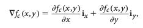

**Equation.1: Gradient of a continuous gray level intensity function fc(x,y), where ix and iy are the unit vectors in the x and y directions [^BOV2009]**

The operator consists of a pair of 2X2 convolution kernels[Fig.2], designed to respond maximally to edges running at a 45° angle.[^MAI2009]

**Fig.2: Robert's Cross operator's horizontal and vertical convolution masks[^MAI2009]**

**

## Sobel 

The Sobel Operator, introduced in a presentation at the Standford A.I Project in 1968 by Irwin Sobel[^SOB1968], is the default algorithm implemented in ImageJ for the Find Edges function, and is considered one of the simplest functional Edge Detection algorithms, it is based on the Robert's Cross operator.

It is based on the gradient of the gray level intensity function[Equation.1]. 

After finding all the local extrema of the gradient magnitude, a thresholding is applied and the points where the magnitude is superior to a given threshold are classified as candidate edge points [Equation.2].

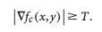

**Equation.2: Thresholding of the gradient magnitude, where T is the threshold[^BOV2009]**

Finally, to obtain edges as zero-width segments, a thinning step is required : if the gradient magnitude is not a local maximum along the gradient direction, the point is suppressed from the edge candidates.

In practice, this algorithm works by using two masks, one horizontal and one vertical[^VIN2009] [Fig.2](this is very similar to the Robert's Cross operator), these masks are designed to respond maximally to edges in the horizontal and vertical directions, respectively, and also smoothen out the gaussian noise in advance to reduce the noise sensitivity of the algorithm.

**Fig.2: Sobel operator's horizontal and vertical convolution masks[^VIN2009]**

The two resulting images are then combined to get an image representing the approximate  absolute  gradient  magnitude of the original image [Fig.3].

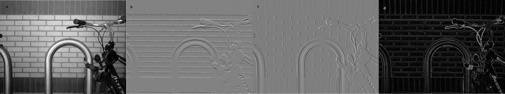

**Fig.3: Result of Sobel filtering. a: original image, b: Sobel Y-gradient image, c: Sobel X-gradient image, d: absolute gradient magnitude image**

## Prewitt
 
The Prewitt operator, developed by Judith M. S. Prewitt[^PRE1970], is also based on the gradient of the gray level intensity function[Equation.1], and functions in  a similar way to the Sobel algorithm, though using different convolution masks[Fig.4]

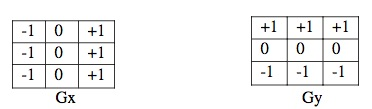
**Fig.4 Prewitt operator's horizontal and vertical convolution masks[^MAI2009]** 

## Laplacian based methods:

The Laplacian is a 2D isotropic measure of the 2nd spatial derivative [Equation.3]. It is used to detect regions of rapid intensity change in an image :
- In the regions of constant intensity (intensity gradient equal to zero), the Laplacian is equal to zero. 
- In regions where there is a change in intensity, the Laplacian is positive on the darker side, and negative on the lighter side.

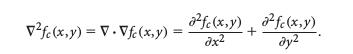

**Equation.3: Laplacian of a continuous gray level intensity function fc(x,y) [^BOV2009]** 

This has the effect of highlighting the edges in the image, and can be used as an enhancement technique, by adding the filtered image to the original image. 

The Laplacian can be estimated by designing a pair of 1D 2nd derivative filters and combining them into a 2D filter [Equation.4]

**Equation.4: Discrete Laplacian estimate for an image f(n1,n2) [^BOV2009]**

Other 3x3 kernels are :

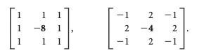

The Laplacian opeator is usually used on gray level images, previously smoothed with a Gaussian filter to reduce noise. It is also possible to convolve the Gaussian smoothing filter with the Laplacian filter, before convolving this Laplacian of Gaussian (LoG) [Equation.5] with the image. 

**Equation.5: Laplacian of Gaussian function gc(x,y), where sigma is the standard deviation of the Gaussian function [^BOV2009]**

To implement a discrete form, a filter can be constructed by sampling this equation after choosing a value for sigma. The Gaussian and Laplacian kernels are both small so it requires fewer operations than using both filters on the image. Another advantage of the LoG is that it can be calculated in advance as it is independent of the image being processed. It is important to note that the result of these edge detectors is highly influenced by the standard deviation used for the Gaussian filter chosen for the smoothing step. The LoG can also be approximated by the Difference of Gaussian (DoG).

It is not possible to directly extract the edge orientation information from the Laplacian output. To extract the edges, we need to detect the zero-crossings in the output of the Laplacian (or the LoG), i.e. the regions of the image where the Laplacian passes through zero. However this can also happen in regions that are features other than edges in the image and can be the cause of false positives.
The input of the zero-crossing detector is the LoG filtered image, and the output is a binary image with lines representing the positions of all the zero-crossing points. Each pixel of the image is compared to its eight immediate neighbors, and a pixel is classified as a zero-crossing if its sign is different than the sign of its neighbor. [Equation.6] 

**Equation.6: Zero-crossing classification of a pixel p [^BOV2009]**

All of the contour lines are closed lines because the strength of the edge is not considered, so even gradual intensity transitions result in a zero-crossing. As previously indicated, local minima of the gradient magnitude can cause false edges, that can be eliminated by using a threshold for edge strength, causing breaks in the closed contours.

In ImageJ, two plugins provide an implementation of the LoG operator.
The first one is the Laplacian plugin included in the FeatureJ package created by Erik Meijering. This plugin is based on ImageScience, a java library for image processing, which provides tools for computing the LoG of an image and detecting the zero-crossings. The only parameter accessible to the user is the laplacian smoothing scale, meaning the standard deviation used for the Gaussian kernel.
The second one is the LoG\_Filter plugin, by Lokesh Taxali and Jesse Jin. This plugin is composed of a unique class file and provides more parameters to the user : sigma (standard deviation for the Gaussian filter), filter width (size of the LoG kernel), threshold for 1D DoG filtering, and delta (level for adjusting zero-crossings). Unlike the previous plugin, this one involves thresholding of the LoG output with a Difference of Gaussians. Moreover, its use is limited to 8-bit images.

## Canny

The Canny operator is often used and known as less sensitive to noise than Sobel's and Laplace's [^ZHA2012], [^ABD2015], despite its important time consumption calculation [^CHAA2014] and its sensibility to textured regions on image which lead to define false edges and discontinuous edges [^CAN1986]. 

The implementation of the Canny model is relatively simple. First a Gaussian filter is applied to the image, then the gradient magnitude of the signal has to be defined. For this stem, the aim is to discriminate edges defined by local maxima by comparing its value to its two closer neighbors. This firsts steps lead to a first edge map. A thresholding is then done on the map by defining a low and high threshold values which will define major and minor pixels used for a thresholding final step hysteresis. All the edge pixels which value is above the higher threshold will be kept on the map, but the pixels of this edge which are under the lower value will be removed. This last point can lead to disrupted edges [^CAN1986], [^DER1987], [^DIN2001], [^BOV2009], [^ABD2015].

In the original work by Canny in 1986 the author defines the signal [Fig.1] as the combination of a noise function and an edge function. So the edge is detected by the convolution of the signal with a specific filter. The aim of the author was to find mathematically a function which will define edge and be able to take care of three parameters. First of them the detection of the edge, define it as close as possible of the real edge on the picture, and assure the unambiguity of the signal. For this last point, often the signal is not a smooth curve [Fig.1] but a series of small maxima close to each other, which can lead to the detection of two edges instead of a single one. 
The first parameter affects the number of false-negatives and the two last the number of false positives [^CAN1986]. So, they define that the best edge function will be the one to maximize the following equation [Equation.7]. The SNR is the signal-to-noise ratio, which has to be as high as possible simultanenously with the localization. That's why the author uses their product. The third part concerns the sum of the additional constraints that the function has to take into account, as the reduction of edges due to local maxima, and will be defined as the sum of the series of penalty functions. For this, they define an expression for the distance between adjacent noise peaks in a defined space, using the Rice noises studies about the response of a function to a Gaussian noise [^RIC1945]. This solution involves the first and the second derivative of the answer function and leads to the definition of a factor which will define the number of maxima in a specific width which can lead to a false answer. This factor corresponds to a fraction of the defined interval of the beginning. The SNR assesses the quality of a signal according to a model, by using the model as numerator and the noise definition as the denominator. In this case, both parameters are defined as integral, respectively the absolute value of a convolution integral and the root-mean-square response to the noise function which will represent the area of dispersion from the model. Each additional constraint will be modulated by a specific value which will define the importance of the associated constraint in the model. As edges are defined as local maxima, the addition of the firsts derivatives of the edge function and noise function is equal to zero [Fig.1], so both of them are opposite and can be used to define the localization parameter. It will be defined as the first derivative of the SNR function.

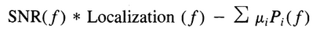

**Equation.7: Equation used to define the best function to find edges from a grey-level signal, with f as the function which is used to define edges, and Pi the constrains i modulated by its associated factor µiEquation used to define the best function to find edges from a grey-level signal, with f as the function which is used to define edges, and Pi the constrains i modulated by its associated factor µi [^CAN1986]**

After several demonstrations, Canny originally defined the Gaussian operator as the most efficient to maximize this equation [Equation.8], and it has the advantage to be easier to implement for a two dimensional model. 

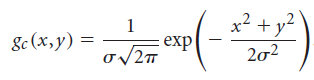

**Equation.8: Gaussian filter [^CAN1986]**

Several modification where done to the model in order to improve its efficiency, as the Deriche modification, allowing the model to treat an infinite extent which lead to a change of the efficiency of the Canny method according to the values considered after a Fourier transformation, leading to the development of a new fonction with only one constant parameter α [^DER1987] [Equation.9], or the Ding modification, able to take into account pixels under the low threshold value in order to correct the edge disruption [^DIN2001].

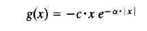

**Equation.9: Gaussian filter and its first derivative [^DER1987]**

Currently, several plugins using this method have been developed for ImageJ : the Edge Detection by Canny-Deriche filtering by Thomas Boudier,  the Edge Detector by Carmelo Pulvirenti, able to use other operators (LoG, DroG) and FeatureJ Edges by Erik Meijering. All of them require from the user a Gaussian kernel value or any other similar parameter which will be involved in the initial treatment step by the Gaussian filter, and will define the width of the neighborhood in which only a single peak will be identified, and the low and high threshold value. As we haven't managed to make the Carmelo Pulvirenti plugin work, it was not used in this analysis. Also, the latest review on its plugin was in July 2007, whereas it was in April 2015 for the Thomas Boudier plugin and December 2015 for the Erik Meijering plugin according to the github of the plugin. 

## Approaches for color images

Unlike greyscale, images encoded in a color space are composed of three channels, which makes the computation trickier. Algorithms for color images usually only take the luminance component into account. This is a cost effective method because according to the color space either the luminance is one of the channels or it can be computed directly, for example with an RGB image. However, all edges are not necessarily best described by the luminance component, which results in a number of false negative edge pixels candidates. Another approach is to construct a cumulative edge map from each component of the image (for example after calculating the sum of the gradient magnitude of the three channels of an RGB image), but the results will be biased depending of the chosen color space. [^BOV2009]

Some algorithms developed for edge detection in color images based on vector approaches are described in papers by Trahanias and Venetsanopoulos [^TRA1993] and Scharcanski and Venetsanopoulos [^SCH1997].

## Benchmarking process

*benchmark definition [^MCN1992] je trouve que des versions payantes de cet article / livre donc euhhh ?* 

The performance and the efficiency of each edge detection function can be assessed through several parameters: the execution time necessary for the processing of an input image and the memory load corresponding to this opperation.

To perform this benchmark, we implemented a small JavaScript plugin : *benchmark.js*. This script measures, on one hand the time elapsed between the start and the end of a given ImageJ or plugin function, and on the other hand the memory used by ImageJ JVM at the end of this function. Java uses a garbage collector to handle memory allocation so our results have to be treated cautiously,even if we forced the garbage collector to run before the execution of the function. The image used for this benchmark is Lena, 8-bit, 256x256 pixels. 

For both measurements we ran the operation 100 times, after a front loading step consisting of running each function five times without recording the results. This was done to avoid outliers in our data, because the first executions of a function are usually slower because of internal allocations and loading of images in RAM or cache. 

The benchmark was done using a computer with an Intel core I7 @4.0 Ghz, on Linux Ubuntu 16.04 64 bits with a kernel 4.10. The version of ImageJ is the 1.51q, using Java 1.8.0\_112 (64 bits). We fixed the processor fequency with acpi-cpufreq module to avoid a change of frequency during the benchmark, fixed the choice of processor with the taskset command to avoid a sharing of the processor load, and finally we fixed the ImageJ process with a high priority to avoid preemption.  

# Results

The results obtained with each edge detection function were obtained with the same image : Lena 256x256 pixels. All plugins except Canny Edge Detector can only be used on greyscale images, so we chose to use the 8-bit version of this image. 

## Implementations of Sobel algorithm

The output of ImageJ Find Edges function is an 8-bit image in which the contours are in white [Fig.5]. Edges are founded but some of them seem to have a width define by several pixels or be made of multiple edges with a one pixel width side by side. It is also difficult to visualy define a precise enclosed contour-like structure.

**Fig.5: Result of Find Edges function. 1:Input image, 2:Output image**

## Implementations of Laplacian of Gaussian algorithm

The FeatureJ Laplacian only provides the display of the output of the LoG and the zero-crossing detector [Fig.6]. The contours are also of single-pixel width and in absence of a thresholding all contours are closed lines.

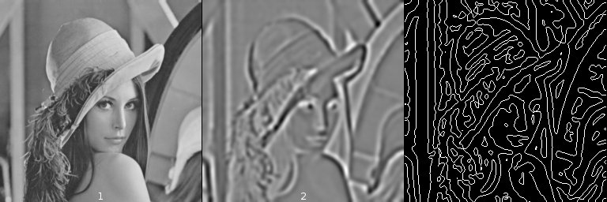

**Fig.6: Result of FeatureJ Laplacian plugin, with smoothing scale=3 1:Input image, 2:LoG output, 3:Zero-crossings **

Choosing a higher standard deviation for the gaussian filtering reduces the number of false positives but also reduces the precision for true positive edges [Fig.7].
 
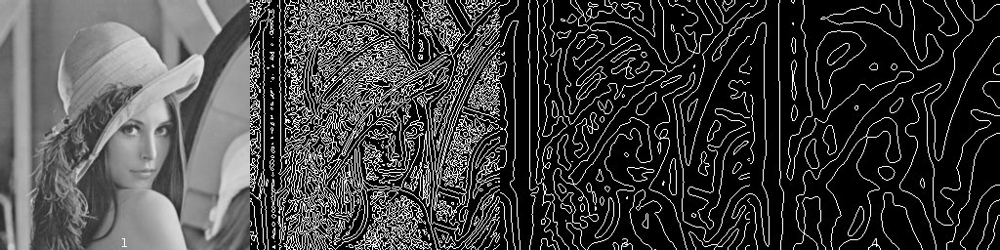

**Fig.7: Result of FeatureJ Laplacian plugin, with various smoothing scales. 1:Input image, 2:smoothing scale=1, 3:smoothing scale=3, 4:smoothing scale=5 **

With the Log\_Filtering plugin, we can compute the output of the LoG filtering (in a 0 to 255 range), the absolute value of filtering, the results representing the LoG values -1, 0 or 1, the zero-crossings overlaid to the input image,  and finally the output of the zero-crosing detector. The final output is a binary image where the edge pixels are in white [Fig.8]. All the contour lines have a single-pixel width, and due to the DoG filtering the final output is the edges of the contour zones detected by the LoG.

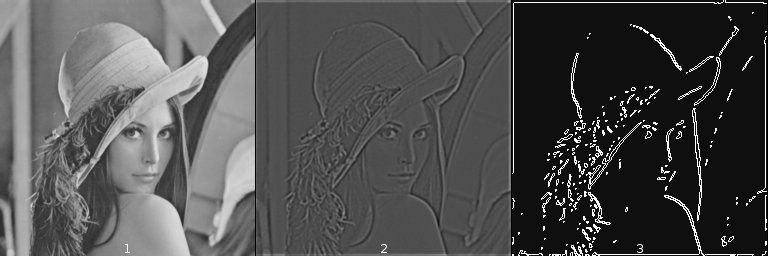

**Fig.8: Result of Log\_Filter plugin, with sigma=3, filter width=2, DoG threshold=0 delta=0. 1:Input image, 2:LoG output, 3:Absolute value of filtering, 4:Results representing values -1,0 or 1, 5:Zero-crossings overlaid to input image, 6:Zero-crossings **

While the result is different from the one given by FeatureJ, we can see that the influence of the standard deviation is similar : a higher value for the smoothing step leads to imprecise contours and the loss of the objects’ shapes [Fig.9] . Here the thresholding step prevents us from seeing the impact of the noise removal on the number of false positive edge pixels.

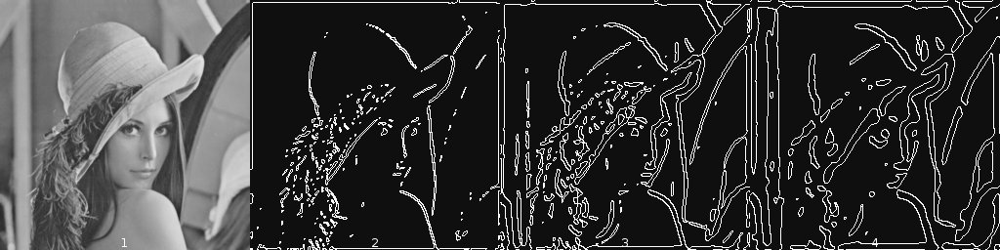

**Fig.9: Result of FeatureJ Laplacian plugin, with various smoothing scales. 1:Input image, 2:smoothing scale=3, 3:smoothing scale=5, 4:smoothing scale=9 **

## Implementation of Canny algorithm

The outputs of Canny Edge Detector and featureJ edges are a binary image where the edge pixels are white [Fig.10].Comparing the outputs of the two Canny implementations when using the same parameters we found that the results are similar.

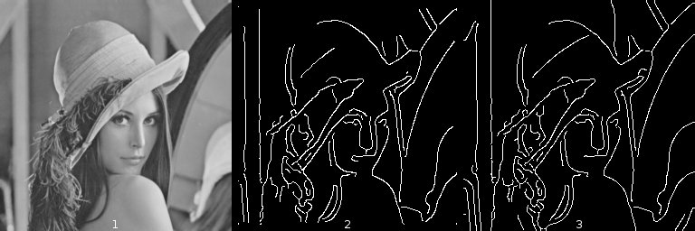

**Fig.10: Result of Canny algorithm plugins, with gaussian kernel radius=2, low threshold=2.5, high threshold=7.5. 1:Input image, 2:Output of Canny Edge Detector, 3:Output of FeatureJ Edges **

Knowing this, we decided to test the influence of each parameter only for the Canny Edge Detector plugin, assuming that the results given by FeatureJ Edge would be the same. A variation of the standard deviation of the Gaussian function  [Fig.11] has an influence of the number of pixels classified as edges by the function : with a standard deviation of 1.0 the contours of the eyes, nose, mouth and feathers are well defined, but some contours are created which have no physical sense like the line below the right eye. Raising this value to 2.0 and then 3.0 makes weaker edges disappear from the results, until only the outlines remain.

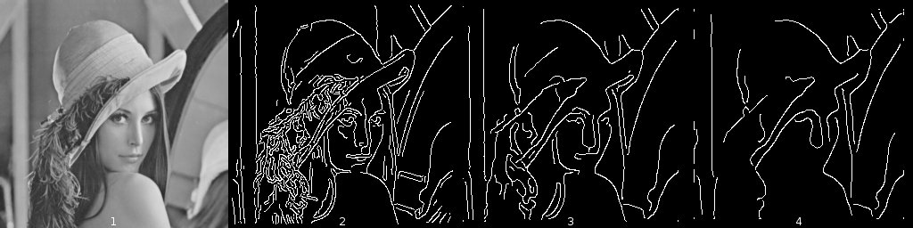

**Fig.11: Result of Canny Edge Detector plugin, with various gaussian kernel radius, low threshold=2.5, high threshold=7.5. 1:input image, 2:radius=1.0, 3:radius=2.0, 4:radius=3.0**

We then changed the value of either the low or the high threshold values [Fig.12]. A reduction of the low threshold does not seem to have an impact on the result, but an augmentation of the high threshold reduces the number of edges detected and creates gaps in continuous edges.

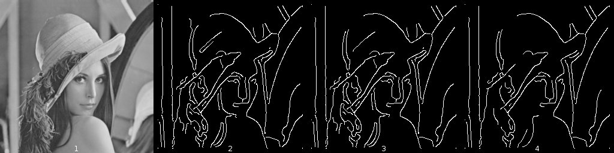 

**Fig.12: Result of Canny Edge Detector plugin, with gaussian kernel radius=2.0 and various low and high thresholds. 1:input image, 2:low threshold=2.5 and high threshold=7.5, 3:low threshold=0.1 and high threshold=7.5, 4:low threshold=2.5 and high threshold=10**

## Benchmark results

The results of the benchmark for the execution time [Fig.13 and Fig.15] show that the Find Edges function is the quickest to run on this machine, with a mean of 0.88 ms, followed by Log\_Filter, FeatureJ Laplacian and FeatureJ Edges which do not have a mean execution time superior to 50 ms. However the Canny Edge Detector plugin has an average exectution time of 205.8 ms.

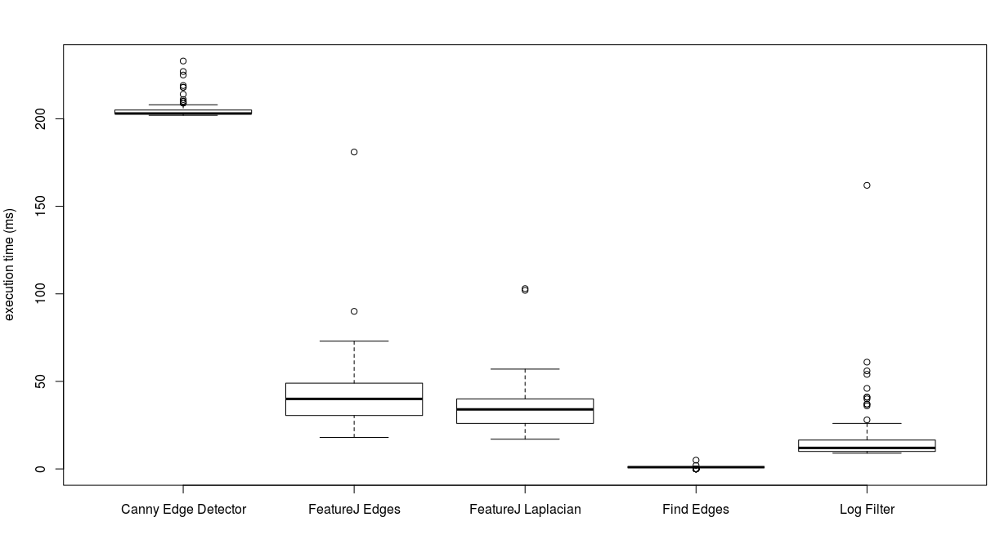

**Fig.13: Result of the benchmark for the execution time of ImageJ edge detection functions. Canny Edge Detector adn FeatureJ Edges: Canny, FeatureJ Laplacian and Log Filter: LoG, Find Edges: Sobel**

For the JVM memory load [Fig.14 and Fig.15], we can see that Find Edges uses the least memory, with a mean of 27.4 MegaBytes. Then the three functions Canny Edge Detector, FeatureJ Edges and Log\_Filter have an average of about 50 MB. And finally the most memory expensive function is FeatureJ Laplacian with a mean of 55 MB.

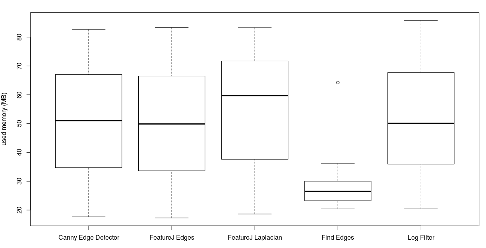

**Fig.14: Result of the benchmark for the memory load of ImageJ edge detection functions. Canny Edge Detector adn FeatureJ Edges: Canny, FeatureJ Laplacian and Log Filter: LoG, Find Edges: Sobel**

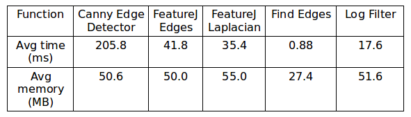

**Fig.15: Average execution time and used memory for ImageJ edge detection functions. Canny Edge Detector adn FeatureJ Edges: Canny, FeatureJ Laplacian and Log Filter: LoG, Find Edges: Sobel**

Given that the Canny Edge Detector plugin can also be used on RGB images, we also ran a benchmark comparing the execution time and memory load difference for this plugin on RGB and 8-bit images[Fig.16].

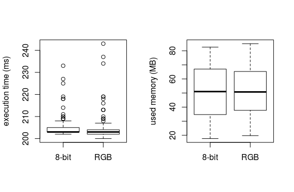

**Fig.16: Result of the benchmark of Canny Edge Detector plugin on 8-bit and RGB images, for both execution time and memory load**

# Discussion

## Qualitative Comparison

As can be seen in the above examples [Fig.5-12], the quality of the resulting edge detection depends a lot on which algorithm is used, and with what parameters. The outputs of all functions show us that the strong contours, corresponding to the hat,the face and the hair are well identified, while the contours of the details, like the hat's feathers are not detected.
 
For the Sobel algorithm, the edges are outlined correctly, though it also outlines noise (shadows, changes in color) as edges.
 
The Laplacian based algorithms, on the other hand, give an output with a lower amount of misidentified noise if configured properly, although they do not identify all of the edges.
As can be seen in the difference of output between the Log\_filter plugin [Fig.8 Image 5-6], which detects most edges without noise in the result, but misses out on edges which were blurred in the original image and the FeatureJ implementation [Fig.6 Image 3], that creates an output image that identifies edges everywhere in the image, leading to an output image that is hard to compare with the original image.
This error on the part of the FeatureJ implementation is most likely due the absence of thresholding, leading to the identification of very small variations in pixel values as indicative of an edge, whereas they are probably due to noise. 
 
We must note that comparing these two results is difficult because the parameters provided to the user for the computation are not the same, except for the gaussian standard deviation. The results optimization is also different : while the FeatureJ plugin stops at the detection of the zero-crossings, the Log\_Filter uses an additional DoG filtering as a threshold on the LoG output.
 
The two Canny implementations [Fig.10] give a better result than both the Sobel implementation, because they are less sensible to noise, and the LoG implementation, because they detect the real edges more accurately.
They are not perfect, and miss edges where the pixel values do not vary sharply on each side, and create edges in the presence of differences due to lighting.
All in all, the 2 Canny implementations give nearly identical results, though the FeatureJ implementation detects more continuous edges than the Canny Edge Detector.
Canny edge detector is the only plugin working on RGB images, and gives an output similar to the one obtained with the 8-bit image [Fig.17].

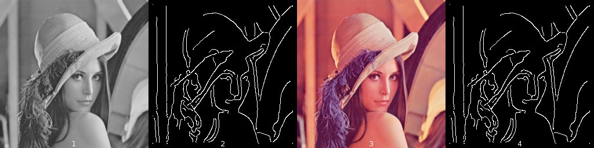

**Fig.17: Result of Canny Edge Detector plugin, with gaussian kernel radius=2, low threshold=2.5, high threshold=7.5. 1:8-bit input image, 2:8-bit output image, 3:RGB input image, 4:RGB output image **

## Performance Comparison

As can be seen in our benchmark results[Fig.13-15], the Sobel algorithm is the fastest Edge Detection implementation in ImageJ, followed by the Laplacian implementations and then the FeatureJ Edge implementation of the Canny algorithm.
The Canny Edge Detector implementation is up to 3 times slower than it's FeatureJ implementation, making it the slowest of all the functions.

As far as memory load goes, most of the algorithms use an average of around 50 MB, with the FeatureJ Laplacian being slightly more voracious (55MB), and the Find Edges (Sobel) algorithm using only 27MB of memory on average.
Sobel being the simplest algorithm, we expected it would also be the least memory intensive, since it only uses first derivatives to determine edges, while the other alogrithms have to compute second derivatives. 

The two Laplacian implementations are difficult to compare, as they do not offer the same customizable parameteres, which might skew the results. The Canny algorithms, though, do offer the same customizable parameters, and can therefore be compared without the danger that a changed parameter is the cause of the differences observed, instead of the implementation itself. 

The enormous difference in speed between the Canny Edge Detector and the FeatureJ Edges plugin can only be explained by the choices made by their developpers during the implementation for ImageJ, as well as the optimizations they added to the original algorithm. Canny Edge Detector is slower than the other plugin but it is also the only one able to process RGB images. Moreover,if we compare the speed and memory load of running the Canny Edge Detector on an RGB image versus on an 8-bit version of that same image, we see no real difference in speed or memory load[Fig.16]. An RGB image being more complex because of its 3 channels, we would have expected higher processing time and memory load when running Canny Edge Detector plugin on the RGB version of our image. This can be explained by the fact that one of the first steps of this function is a conversion of the image to an 8-bit format, meaning that all the folowing steps are the same for all types of images.

# Conclusion

*algorithmes developpés il y a 20-30 ans toujours utilisés aujourd'hui, amélioration des techniques de detection de contours au cours du temps (plus de sensibilité et spécificité). Nouveaux algos / nouvelles optimisations développées de nos jours*

Of all the functions in ImageJ, the fastest and least memory intensive is the Sobel implementation Find Edges, though the function giving the best results (least amount of false positives and false negatives) is the FeatureJ implementation of the Canny Edge Detection algorithm. We can't dismiss the Canny Edge Detector implementation entirely, though, as it is the only one studied capable of processing RGB images. The study of these five examples of edge detection functions showed that there is not a unique ideal choice of algorithm for edge detection. This choice have to take into account the time and memory limitations of an user, as well as the type of images they are working with. 

# References

[^DAV1975]: Davis LS. A survey of edge detection techniques. Computer graphics and image processing. 1975 Sep 1;4(3):248-70.

[^PRE1970]: Prewitt JM. Object enhancement and extraction. Picture processing and Psychopictorics. 1970 Jan 1;10(1):15-9.

[^MAI2009]: Maini R, Aggarwal H. Study and comparison of various image edge detection techniques. International journal of image processing (IJIP). 2009 Jan;3(1):1-1.

[^ABD2015]: Abdelsamea MM, Gnecco G, Gaber MM, Elyan E. On the relationship between variational level set-based and som-based active contours. Computational intelligence and neuroscience. 2015 Jan 1;2015:34.

[^BOV2009]: Bovik AC, editor. The essential guide to image processing. Academic Press; 2009 Jul 8.

[^CAN1986]: Canny J. A computational approach to edge detection. IEEE Transactions on pattern analysis and machine intelligence. 1986 Nov(6):679-98.

[^CHAA2014]: Chaabane SB, Fnaiech F. Color edges extraction using statistical features and automatic threshold technique: application to the breast cancer cells. Biomedical engineering online. 2014 Jan 23;13(1):4.

[^DIN2001]: Ding L, Goshtasby A. On the Canny edge detector. Pattern Recognition. 2001 Mar 31;34(3):721-5.

[^DER1987]: Deriche R. Using Canny's criteria to derive a recursively implemented optimal edge detector. International journal of computer vision. 1987 Jun 1;1(2):167-87.

[^RIC1945]: Rice SO. Mathematical analysis of random noise. The Bell System Technical Journal. 1945 Jan;24(1):46-156.

[^ZHA2012]: Zhao J, Zheng W, Zhang L, Tian H. Segmentation of ultrasound images of thyroid nodule for assisting fine needle aspiration cytology. Health information science and systems. 2013 Dec 1;1(1):5.

[^SCH2015]: Schindelin J, Rueden CT, Hiner MC, Eliceiri KW. The ImageJ ecosystem: An open platform for biomedical image analysis. Molecular reproduction and development. 2015 Jul 1;82(7-8):518-29.

[^SOB1968]: Sobel I. An isotropic 3× 3 image gradient operator, presentation at Stanford Artificial Intelligence Project (SAIL).

[^VIN2009]: Vincent OR, Folorunso O. A descriptive algorithm for sobel image edge detection. InProceedings of Informing Science & IT Education Conference (InSITE) 2009 Jun 12 (Vol. 40, pp. 97-107).

[^MAR1980]: Marr D, Hildreth E. Theory of edge detection. Proceedings of the Royal Society of London B: Biological Sciences. 1980 Feb 29;207(1167):187-217.

[^MCN1992]: McNair CJ, Leibfried KH. Benchmarking: A tool for continuous improvement. John Wiley & sons; 1992.

[^TRA1993]: Trahanias P.E and Venetsanopoulos A.N. Color edge detection using vector order statistics. IEEE
Trans. Image Process., 2(2):259–264, 1993. 

[^SCH1997]:Scharcanski J and Venetsanopoulos A.N. Edge detection of color images using directional
operators. IEEE Trans. Circuits Syst. Video Technol., 7(2):397–401, 1997. 
