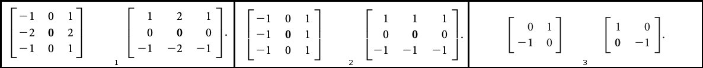
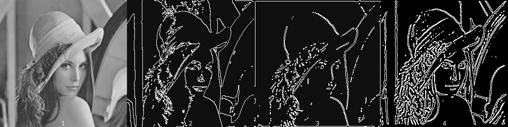
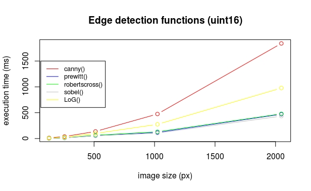
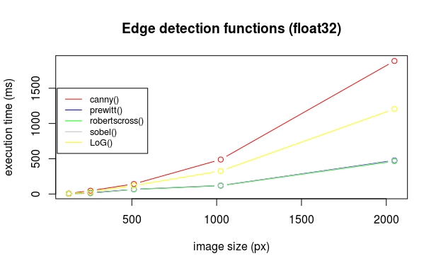
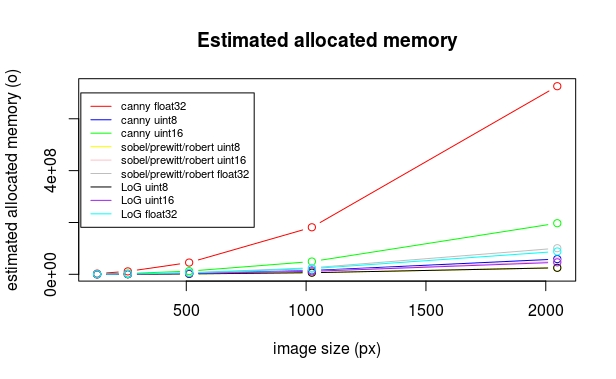
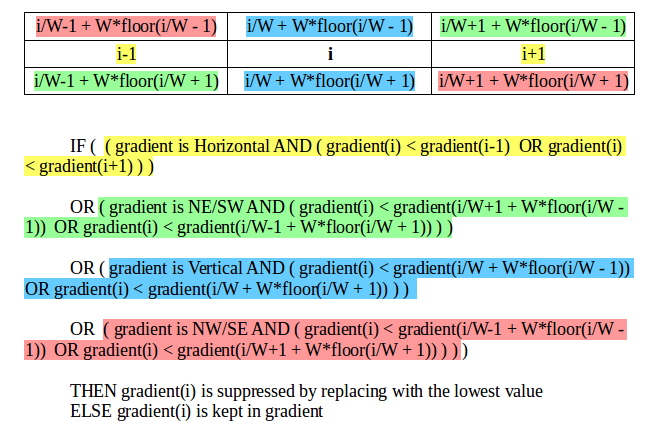
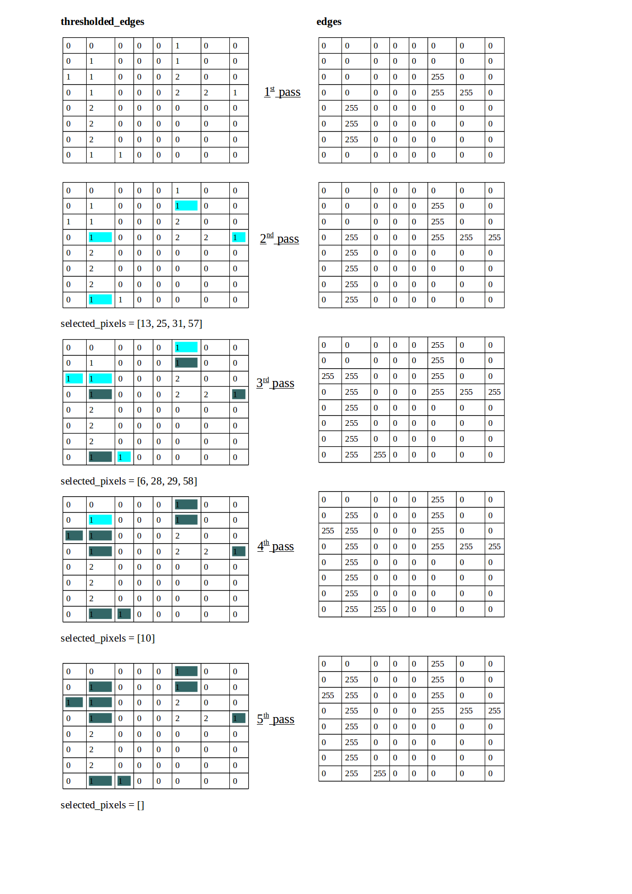

# Edge detection

Authors : Peter Bock\*, Cécilia Ostertag, Ophélie Thierry

## Introduction

Image processing is one of the most important fields in the domain of computer vision[^BOV2009]. Most scientific domains use information extracted from images in one way or another. For a computer to make sense of these images, and be able to extract meaningful data from them, it needs to be able to interprete and understand them.
That is where Image Processing comes in, allowing a computer to process an image and detect its major features, and to perform higher-level vision tasks like face recognition.
In our project, we will examine one specific field of image processing called edge detection.

The physical notion of edge comes from the shape of three dimensional objects or from their material properties. But, seeing as the acquisition process translates 3D scenes to 2D representations, this definition does not apply to image processing. In this report we will use the following definition by Bovik[^BOV2009] (2009): "An edge can generally be defined as a boundary or contour that separates adjacent image regions having relatively distinct characteristics according to some features of interest. Most often this feature is gray level or luminance”. According to this definition, the pixels of an image belonging to an edge are the pixels located in regions of abrupt gray level changes. Moreover, to avoid counting noise pixels as edges, the pixels have to be part of a contour-like structure.
Edge detection is the process of finding the pixels belonging to the edges in an image, and producing a binary image showing the locations of the edge pixels.

In our project, we began by documenting the main linear edge detection approaches and algorithms, and their implementation in the image processing software ImageJ[^SCH2015]:

* Convolution with edge templates (Prewit[^PRE1970], Sobel[^SOB1968], Kirsch[^KIR1971], Robert's Cross[^ROB1963])
* Zero-crossings of Laplacian of Gaussian convolution[^MAR1980]
* Zero-crossings of directional derivatives of smoothed images (Canny[^CAN1986])

We then performed a benchmark on the ImageJ plugins, in order to compare their execution time and the memory load for the Java Virtual Machine (JVM).


For this second part of our project, we have chosen to make our own implementations of the Sobel, Prewitt, Robert's cros, Canny and Laplacian of Gaussian operators using ECMAscript6[^ECMA2011].


**Our report ( written using the markdown format), and associated files, is stored in a repository on github:**
https://github.com/bockp/Edge-Detection-project


## Material & Methods

### Utility functions :


#### padding(data,W,H,pad,copy_mode=true)

Returns a padded version of an image (whose pixel values are in the __data__ array), so it can be entirely convolved by a kernel whose radius is equivalent to __pad__.

The __W__ and __H__ arguments represent the image's height and width, respectively.


#### *convolve(raster, kernel, copy_mode=true)*

This function convolves the image (pixel values stored in the __raster__) using the given kernel __kernel__.

First, it checks if the kernel's dimensions are correct (the kernel must have an uneven size), and throws an error if not.

It then pads the image with enough 0 pixels (half the kernel's size, floored downwards) to enable the kernel to be applied to every pixel of the original image, including edge pixels.

it then aplies the kernel to every pixel in the original image,
only taking the padding into account to calculate values for edge pixels, and saves the new pixel values in a separate array that is returned to the user.


#### *gradient(raster, herH, kerV, copy_mode=true)*

This function computes gradient magnitude of an image (using the pixel values stored in it's __raster__).

It does so by convolving the image separately with the horizontal (__kerH__) and vertical kernels ( __kerV__), using the *convolve()* function, then combines the results using euclidean distance averaging. 

[^Ref for wwhy euclidean distance can be used this way?]


#### *normalizeConvResult(data,type)*

This function normalizes the result of a convolution (convolved image data in __data__, image type given by __type__).

by setting values inferior to the minimal value to be equal to the minimal value, and values superior to the maximal value to be equal to the maximal value (min and max values depend on the __type__ of the image).


#### *unitaryLoG(x,y,sigma)*

This function calculates the value of the Laplacian of Gaussian at a specific point in a matrix, using the combined formulas for calculating the Laplacian fo Gaussian distribution in 2D, using __x__, __y__, and __sigma__ representing the standard deviation[^OST2017].
Given the squaring of both __x__ and __y__, the values of the Laplacian of Gaussian distribution for (1,-1), (-1,1), (1,1) and (-1,-1) are the same, which gives the symmetrical aspect often seen in square Gaussian kernels.


#### *unitaryGaussian(x,y,sigma)*

This function calculates the value of the Gaussian at a specific point in a matrix, using the formula for generating a Normal distribution in 2D, using __x__, __y__ and __sigma__ representing the standard deviation[^OST2017].
Given the squaring of both __x__ and __y__, the values of the Gaussian distribution for (1,-1), (-1,1), (1,1) and (-1,-1) are the same, which gives the symmetrical aspect often seen in square Gaussian kernels.


#### *kernelGenerator(kernelSize, sigma, kernelFunction)*

This function generates an kernel of size __kernelSize__ (which must be an unpair number), using the __kernelFunction__ given with __sigma__ as one of the arguments.

The __kernelFunction__'s accepted are *unitaryLoG()* or *unitaryGaussian()*

It does this by determining a kernel radius (size/2) and using the __kernelFunction__ to calculate the correct valyue for every X and Y position in the wanted kernel, centered at the middle around the coordinates (0,0).


#### *gaussianKernel(kernelSize,sigma)*

Uses the *kernelGenerator()* and *normalize()* functions to create a normalized Gaussian kernel, using *unitaryGaussian* as the __kernelFunction__ argument to *kernelGenerator()*.


#### *logKernel(kernelSize,sigma)*

Uses the *kernelGenerator()* and *normalize()* functions to create a normalized Laplacian of Gaussian kernel, using *unitaryLoG* as the __kernelFunction__ argument to *kernelGenerator()*.


#### *theta4directions(theta)*

Rounds the gradient orientation (__theta__, representing the image gradient orientation values) values into four directions : 0, 45, 90, and 135 degrees represented by the numbers 0, 1, 2, and 3.


#### *nonmax(W, H, grad; theta, type)*

Performs non maximum suppression in 8-connectivity : pixels that are not the maximum value in their gradient direction (__grad__) are replaced by the lowest pixel value according to the image __type__.

__W__ and __H__ are the image dimensions.


#### *hysteresis(W, strong_edges, threshold_edges)*

Performs hysteresis in 8-connectivity : first, the weak edge pixels next to strong edge pixels (__strong_edges__) are kept, and then the selected non selected weak edge pixels next to a strong edge pixel in several passes


---------------


Two of these functions, *gaussianKernel()* and *convolve()* were coded by us because we needed them for the edge detection functions, but should be replaced by the functions coded by the “Filters” group in the final TIJ application, so they were not optimized here.

While describing which utility functions are used by our different edge detection Operators, we will cite only the one's used directly by the Operator, leaving the other utility functions used by the cited utility functions out.

### Principal functions

All of our principal functions take as first parameter the raster containing the pixels values of an image, and output a modified raster. They all work with uint8, uint16, and float32 images. To avoid using FOR loops as much as possible they were replaced by the use of Ecmascript *map* and *forEach* functions. Also to avoid accumulating IF… ELSE conditional statements, they were replaced when possible  the use of the ternary operator and compacted with the use of OR and AND logical operators.

### Implementation of Sobel, Prewitt, and Robert’s cross operators :

The three following algorithm work following the same two steps :
- Convolving the image with the horizontal and vertical kernels to approximate respectively the horizontal (Gx) and vertical (Gy) derivative of the image
- Computing the gradient magnitude using Gx and Gy ([Fig.?])



**Fig.?: Horizontal and vertical kernels 2D kernels : 1:Sobel operator, 2:Prewitt operator, 3:Robert's cross operator**

The result is an image in which the edges have high pixel values compared to the rest of the image.  The only difference is the kernels used by each algorithm 
Those kernels are defined as global variables in the beginning of our script. Robert’s cross kernels are 2x2 so they have to be padded with zeros to be used in our *convolve()* function.

The three functions *sobel()*, *prewitt()* and *robertscross()* use the utility functions *convolve()*, *gradient()*, and *normalizeConvResult()* described previously.  To display the image, the lowest and highest values are capped to those allowed by the type of the original image. The following pseudo-code sums up our implementation :

```
Gx = convolve (raster, horizontal kernel)
Gy = convolve (raster, vertical kernel)
gradient = sqrt(Gx²+Gy²)
FOR pixel value IN gradient :
	IF pixel value < lowest value allowed by image type
		pixel value = lowest value
	ELSE IF pixel value > highest value allowed by image type
		pixel value = highest value
	ELSE
		do nothing
	END IF
END FOR
RETURN gradient
```

### Implementation of the Laplacian of Gaussian Operator :

The Laplacian of Gaussian (LoG) algorithm we've chosen to implement is composed of these general steps:

- Generation of a LoG kernel of size 9 using the following formula:


**Fig.?: Mathematical formula of the LoG kernel, created by combining the Laplacian kernel formula with the Gaussian kernel formula.**


**Fig.?: Discrete representation of the 9X9 LoG kernel.**

- Convolution of the image with the given LoG kernel.

- Thresholding of the output by 0 to get a binary image.

- Zero-crossing detection to improve the edge detection.

including optimization to detect as zero-crossing only the foreground pixels with at least one background pixel neighbour.

The Laplacian of Gaussian takes as arguments the raster containing the image pixels, the LoG kernel size and the standard deviation (sigma) value for the LoG kernel generation.

The output is a uint8 binary image in which the edge pixels have the highest pixel value (white) and the other have the lowest value (black).

This function uses the utility functions *convolve()* and *logKernel()*.

The following pseudo-code sums-up our implementation :
```
Output = copy image pixel values from image raster
Set output type to uint8
Initialize output.pixelData as a Uint8ClampedArray of the same length as the raster, to store result of the function in
W = raster's width

ker = create a LoG kernel using logLernel(wanted kernel size, standard deviation/sigma value for Gaussian)
log_data = convolve raster using the generated Ker kernel

Threshold the image

FOR pixel_value IN log_data:
	IF pixel_value >= 0:
		pixel_value = 0
	ELSE:
		pixel_value = 255
END FOR
Store result in thr_img

zero_cross = []

FOREACH pixel_value and integer_counter IN thr_img:
  	IF thr_img[integer_counter] is foreground (255) 	 AND has at least one Background (0) neighbour:
			 Add a 255 to Zero_cross, as this is a zero-crossing.
		ELSE:
			 Add a 0 to Zero_cross.
END FOREACH

Set output.pixelData to contain Zero_cross


RETURN output
```

### Edge detection using Canny’s algorithm :

Canny’s algorithm uses the following steps:
- Noise reduction by convolving the image with a Gaussian filter of a given standard deviation
- Computation of the intensity gradient magnitude and orientation 
- Dividing orientation values (theta) into 4 directions : horizontal (0°), north-east /south-west(45°), vertical (90°), and north-west/south-east direction (135°)
- Non-maximum suppression by only keeping pixels which value is the maximum compared to the values of the two surrounding pixels according to the gradient orientation (see [Fig.?] in Annex)
- Finding strong edge pixels and weak edge pixels using a low and a high threshold values
- Tracing edges with hysteresis, by keeping weak edge pixels next to strong edge pixels and then extending the edges in several passes (see [Fig.?] in Annex)

The *canny()* function takes as parameter the raster containing the pixels of the image, the low and high threshold for the hysteresis (in the range 0 to 255), and the standard deviation value for the Gaussian filter. The output is a uint8 binary image in which the edge pixels have the highest pixel value (white) and the other have the lowest value (black). This function uses the utility functions *convolve()*, *gaussianKernel()*, *normalizeConvResult()*, *theta4directions()*, *nonmax()*, and *hysteresis()*. The following pseudo-code sums-up our implementation :

```
IF image type = uint16
	multiply low and high threshold by 256
ELSE IF image type = float32
	divide low and high threshold by 128 and substract 1
ELSE IF image type = uint8
	do nothing
END IF
data = convolve(raster, Gaussian Kernel of size 9 and standard deviation sigma)
put data in raster
Gx = convolve(raster, horizontal Sobel kernel)
Gy = convolve(raster, vertical Sobel kernel)
gradient = sqrt(Gx²+Gy²)
theta = atan2(Gx,Gy)
theta = theta4directions(theta)
newGradient = []
FOR pixel value in gradient
	IF pixel is at the border of the pixel OR  pixel value <= surrounding pixels values in gradient direction
		push lowest pixel value to newGradient
	ELSE
		push current gradient value to newGradient
	END IF
END FOR
strong_edges = []
FOR value in newGradient
	IF value > high threshold
		add 255 to strong_edges
	ELSE
		add 0 to strong_edges
	END IF
END FOR
thresholded_edges = []
FOR value in newGradient
	IF value > high thresholded
		push 2 to thresholded_edges
	ELSE IF value > low_threshold
		push 1 to thresholded_edges
	ELSE
		push 0 to thresholded_edges
	END IF
END FOR
edges = strong_edges
chosen_pixels = []
FOR i IN range(length(edges))
	IF thresholded_edges[i] = 1 AND thresholded_edges[any surrounding pixel in 8-connectivity] = 2
		push i to chosen_pixels
		edges[i]=255
	END IF
END FOR
WHILE length(chosen_pixels) > 0
	new_pixels = []
	FOR i IN chosen_pixels
		IF thresholded_edges[any pixel surrounding ith pixel in 8-connectivity] = 1 AND edges[corresponding pixel] = 0
			push corresponding pixel index to new_pixels
			edges[corresponding pixel]=255
		END IF
	END FOR
	chosen_pixels = new_pixels
END WHILE
RETURN edges
```


## Results

### Edge detection using Sobel, Prewitt, and Robert’s cross operators

The two pictures below show the result given by ImageJ’s function FindEdges[^RUE2017] which uses Sobel operator, and our *sobel()* function. We can see that we obtain quite similar results [Fig.?]


**Fig.?: Result of Sobel filtering. 1:original image, 2:output of our function, 3:output of ImageJ Find Edges**


The two following pictures show the result of edge detection using our *prewitt()* and *robertscross()* function [Fig.?]. 


**Fig.?: Result of Prewitt and Robert’s cross filtering. 1:original image, 2:output of our prewitt() function, 3:output of our robertscross() functions**

### Edge detection using the Laplacian of Gaussian algorithm:

The 4 pictures below show the results of applying the FeatureJ[^MEI2007] Laplacian to the Lena 8bit image, and compares it to the results obtained using our own implementation.


**Fig.?: (1) original Lena 8bit image, (2) FeatureJ simple LaPlacian using Smoothing = 3, (3) FeatureJ simple LaPlacian using Smoothing = 5, (4) TIJ LoG with sigma = 2**

As can be seen, LoG, the combination of the Laplacian kernel with the Gaussian, leads to much better results than a simple LaPlacian kernel, as used by FeatureJ[^MEI2007].

The 3 images below compare the ImageJ plugin Mexican Hat[^PRO2015], which uses a LoG algorithm with a circular kernel (whose radius can be defined) to our own TIJ Ecmascript implementation:


**Fig.?: (1) Lena 8bit image, (2) Mexican Hat/LoG filter with radius = 5, (3) TIJ LoG filter with Sigma = 2**

As can be seen, A Mexican Hat filter with radius 5 gives a similar result to our TIJ implementation with a sigma of 2, but we cannot truly compare the two, given one uses a circular kernel, and the other a rectangular one.

Taking that into account, we can at least see that the results are comparable in quality.

Compared with the plugin Log_Filter by Lokesh Taxali and Dr. Jesse Jin  ([Fig.?]) we can see that we do not have the same results with the same parameters either.



**Fig.?: Result of LoG filtering. 1:original image, 2:output of Log_Filter (sigma=1.4, kernel size=9), 3:output of Log_Filter (sigma=2, kernel size=3), 2:output of our function (sigma=1.4, kernel size=9)**

### Edge detection using Canny’s algorithm :

The following figure represents the result of the *canny()* function with parameters low threshold = 15.0, high threshold = 30.0, and sigma = 2.0. (REF) , compared with the result given by the plugin Canny Edge Detector[^GIB2011] with parameters low threshold = 2.5, high threshold = 5.0, and sigma = 2.0 [Fig.?]. The results are similar but the threshold values do not have the same effect for the detection of edges. Nonetheless, we can see that the edges of the face, hat and shoulder are well detected, as well as some details on the hat feathers. There are false edges at the bottom and right side of the picture, due to the Gaussian filtering step. Onces this function is replaced by the one coded by the “Filters” group it should give the expected result.  


**Fig.?: Result of Canny filtering. 1:original image, 2:output of our function, 3:output of ImageJ Canny Edge Detector plugin**

### Benchmarking process

The benchmark was done using a computer with an Intel core I7 @4.0 Ghz, on Linux Ubuntu 16.04 64 bits with a kernel 4.10. The version of ImageJ is the 1.51q, using Java 1.8.0\_112 (64 bits). We fixed the choice of processor with the taskset command to avoid a sharing of the processor load, and finally we fixed the ImageJ process with a high priority to avoid preemption.

For this benchmark, we used the same picture (Lena, in uint8, uint16 or float32), in five different sizes : 128x128 px, 256x256 px, 512x512 px, 1024x1024 px, and 2048x2048 px, to show how the performance of our functions vary when increasing the complexity of the input image. We performed this benchmark on our functions as well as the functions available in ImageJ described in the previous report. For the implementation of the benchmarks see the files *benchmark.js* for the ImageJ functions, and *benchmarkForTiji.js* for our functions, in our GitHub repository. 


### Benchmark results

#### Execution time

The result of our benchmark for all of our functions for uint8 images ([Fig.?]) show us the result that we expected : the *sobel()*, *prewitt()* and *robertscross()* functions are the fastest and have an almost identical execution time, then the *LoG()* with a 9x9 kernel and sigma=1.4 , and finally the *canny()* function with thresholds equal to 15.0 and 30.0. All the functions take more execution time as the image gets bigger. We can also see that the differences between these three groups are widening as we increase the size of the input image : the results are similar for sizes of 128x128, 256x256 and 512x512 pixels, but for pictures of size 1024x1024 and 2048x2048 the LoG implementation takes twice the time of Sobel, Prewitt and Robert’s cross, and the Canny implementation takes three times the execution time. This result was expected for Canny because its  algorithm works in several passes contrarily to the others.


**Fig.?: Execution time of all of our functions with five increasing image sizes (uint8 images)**

We then compared each of our functions with the existing corresponding functions in ImageJ. First, for the Sobel operator we compared our function with the ImageJ function FindEdges ([Fig.?]). We can see that ImageJ’s function hasan execution time almost constant for all image sizes. With a picture of 2048x2048 pixels, the execution time of our function is more than ten times higher than the Find Edges function. This is due to the fact that the complexity of our function is *n²* because of the convolution step, while ImageJ’s function uses an optimized version of the convolution.


**Fig.?: Execution time of all of our *sobel()* function and ImageJ FindEdges function, with five increasing image sizes (uint8 images)**

For the LoG operator, we compared our function with the plugins Log_Filter by Lokesh Taxali and Dr. Jesse Jin (sigma=1.4, kernel size=9), and FeatureJ Laplace by Erik Meijering (sigma=1.4, kernel size=9) ([Fig.?]). Here we can see that our function outperforms FeatureJ’s for sizes up to 512x512 pixels, but is two time s  slower for 1024x1024 px images, and three times slower for 2048x2048 px images.


**Fig.?: Execution time of all of our *LoG()* function and ImageJ Log_Filter and FeatureJ Laplace plugins, with five increasing image sizes (uint8 images)**

Finally, for Canny algorithm, we compared our function with the plugins Canny Edge Detector by Tom Gibara (thresholds = 2.5 and 5.0, sigma=2) and FeatureJ Edges by Erik Meijering (thresholds = 2.5 and 5.0, sigma=2) ([Fig.?]). Our function outperforms the Canny Edge Detector function, which we showed in our previous report was unexpectedly time consuming.  For sizes up to 512x512 px, our function has a lower execution time than FeatureJ’s, for 1024x1024 px images, it takes twice the time, and is more than three times slower for 2048x2048 px images. 


**Fig.?: Execution time of all of our *canny()* function and ImageJCanny Edge Detector and FeatureJ Edges plugins, with five increasing image sizes (uint8 images)**

With uint16 ([Fig.?]) and float32 ([Fig.?]) images, we can see that the execution time for *sobel()*, *prewitt()* and *robertscross()* functions do not vary, whereas it increases for the *LoG()* and *canny()* functions. However this is a small augmentation, so we can conclude that the type of the image does not have a strong impact on the processing time of our functions. 



**Fig.?: Execution time of all of our functions with five increasing image sizes, for uint16 images**



**Fig.?: Execution time of all of our functions with five increasing image sizes, for float32 images**

#### Memory load

We roughly estimated the memory usage of each of our functions by calculating the size allocated to the arrays (the allocation for the primitive data types are insignificant here). For example in the *sobel()* function we allocate 4 HxW arrays, 2 (H+k/2)x(W+k/2) arrays, and 1 kxk array (with H and W the height  and width of the image, and k the kernel dimension). We estimated this memory usage for uint8, uint16 and float32 images, and for the same image sizes as in our benchmark for the execution time. Our results ([Fig.?]) show that the *canny()* function is the most impacted both by the enlargement of the input image and by the type of the input image. This function allocates 1 HxW uint8 array, 10 HxW arrays of the image type, 3 (H+k/2)x(W+k/2) arrays, plus the kxk array for the gaussian blur and 2 arrays of the image type and variable length during the hysteresis phase, so it was expected to be memory expensive.  



**Fig.?: Estimated memory allocation for of all of our functions, for five increasing image sizes and three image types (uint8, uint16, float32)**


## Discussion

### Qualitative Comparison

While we cannot compare our results for the Prewitt and Robert’s cross operator with a function from ImageJ, we obtain the same results for the implementation of Sobel’s operator, which has an identical algorithm, so it is safe to say that the two other functions give the expected results as well.

For the LoG and Canny algorithm implementation,  we do not obtain the same results as the ImageJ plugins with the same parameters, but we can obtain similar output images by changing the values of these parameters. Our functions can detect “obvious” edges as well as small details in our images. However they are more sensitive to noise because of the Gaussian blurring step that has not been optimized, this leads to false edges in the output, as well as some edges being interrupted or a bit erratic.

### Performance Comparison

Our functions can handle the processing of pictures up to 2048x2048 pixels and maybe higher, and three types : uint8, uint16, and float32. This was also the case of ImageJ’s functions.

They have an important execution time, which increases with the size of the input images. This was expected because our functions rely mostly on convolutions and successive operations on the input pixels. Our implementation of Canny’s algorithm is the slowest of our functions, and gets quickly slower because it needs several passes to elongate the edges.

In terms of memory load, the implementation of Canny’s algorithm is very expensive, while the LoG implementation is closer to Sobel, Prewitt, and Robert’s cross, so the *LoG()* function is a good compromise to have well detected edges without using too much memory.

## Conclusion

Using JavaScript, we implemented the most used edge detection algorithm for images, that can be executed on any web navigator. These functions give results similar to those obtained with the use of ImageJ. However it was expected that our functions would be outperformed by ImageJ’s and plugins, because they are coded in Java which is a more powerful language than JavaScript. Our LoG implementation is the function that gives the better tradeoff between precision in edge detection and execution time / memory load for the CPU.

To achieve better performance, we will use the WebGL JavaScript API to use the GPU instead of the CPU and have faster execution times thanks to its parallel architecture.

## Annex



**Fig.?: Principle of the non-maximum suppression step**



**Fig.?: Principle of the edge tracing step using hysteresis**


*TOUTES les citations doivent etre utilise*


[^GIB2011]: Gibara T. Canny Edge Detector plugin for ImageJ image processor.

[^MEI2007]: Meijering E. FeatureJ: A Java Package for Image Feature Extraction.

[^OST2017]: Cecilia Ostertag, Peter Bock, Ophelie Thierry. Edge Detection Report 1. 2017.

[^ECMA2011]: ECMAScript EC. European Computer Manufacturers Association and others. ECMAScript language specification. 2011.

[^ROB1963]: Roberts LG. Machine perception of three-dimensional solids (Doctoral dissertation, Massachusetts Institute of Technology).

[^BOV2009]: Bovik AC, editor. The essential guide to image processing. Academic Press; 2009 Jul 8.

[^CAN1986]: Canny J. A computational approach to edge detection. IEEE Transactions on pattern analysis and machine intelligence. 1986 Nov(6):679-98.

[^MAR1980]: Marr D, Hildreth E. Theory of edge detection. Proceedings of the Royal Society of London B: Biological Sciences. 1980 Feb 29;207(1167):187-217.

[^PRE1970]: Prewitt JM. Object enhancement and extraction. Picture processing and Psychopictorics. 1970 Jan 1;10(1):15-9.

[^SOB1968]: Sobel I. An isotropic 3× 3 image gradient operator, presentation at Stanford Artificial Intelligence Project (SAIL).

[^RUE2017]: Rueden, C. T.; Schindelin, J. & Hiner, M. C. et al. (2017), "ImageJ2: ImageJ for the next generation of scientific image data", BMC Bioinformatics 18:529, doi:10.1186/s12859-017-1934-z. 

[^PRO2015]: Dimiter Prodanov, Mexican Hat LoG filter plugin for ImageJ
