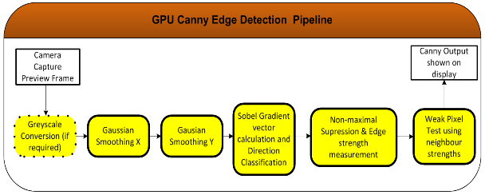

# Edge detection part 3: WebGL implementation

Author : Peter Bock

## Introduction

Image processing is one of the most important fields in the domain of computer vision[^BOV2009]. Most scientific domains use information extracted from images in one way or another. For a computer to make sense of these images, and be able to extract meaningful data from them, it needs to be able to interpret and understand them.
That is where Image Processing comes in, allowing a computer to process an image and detect its major features, and to perform higher-level vision tasks like face recognition.
In our project, we will examine one specific field of image processing called edge detection.

The physical notion of edge comes from the shape of three dimensional objects or from their material properties. But, seeing as the acquisition process translates 3D scenes to 2D representations, this definition does not apply to image processing. In this report we will use the following definition by Bovik[^BOV2009]: "An edge can generally be defined as a boundary or contour that separates adjacent image regions having relatively distinct characteristics according to some features of interest. Most often this feature is gray level or luminance”. According to this definition, the pixels of an image belonging to an edge are the pixels located in regions of abrupt gray level changes. Moreover, to avoid counting noise pixels as edges, the pixels have to be part of a contour-like structure.
Edge detection is the process of finding the pixels belonging to the edges in an image, and producing a binary image showing the locations of the edge pixels.

In our project, we began by documenting the main linear edge detection approaches and algorithms, and their implementation in the image processing software ImageJ. We then performed a benchmark on the ImageJ plugins, in order to compare their execution time and the memory load for the Java Virtual Machine (JVM).

For the second part of our project, we made our own implementations of the Sobel, Prewitt, Robert's cros, Canny and Laplacian of Gaussian operators using ECMAscript6[^ECMA2011].

In this report, I will present the last part of our project : the implementation of the Laplacian of Gaussian algorithm[^MAR1980] using the GPU via the WebGL 2 API.
Finally, I will be able to compare qualitatively and quantitatively the CPU and GPU implementations, and to compare the GPU implementation with the plugin implemented in ImageJ.

**This report (written using the markdown format), and associated files, is stored in a repository on github:**
https://github.com/bockp/Edge-Detection-project

## Material & Methods

### Principle of the Laplacian of Gaussian algorithm :

Laplacian of Gaussian follows these steps:
- Convolving the image with a Laplacian of Gaussian filter of a given standard deviation, which includes a noise reduction step given the presence of the Gaussian.
- Thresholding the output by 0 to get a binary image.
- Detecting Zero-crossings in the convolved image, and keeping only these for the final image, so as to improve edge detection.
### Fragment shaders :

All of the fragment shaders used for this implementation are adapted from Seth George Hall's thesis [^HAL2014] showing an implementation of the Canny edge detection algorithm using OpenGL ES 2.0. It uses a pipeline of five fragment shaders, linked together via framebuffers ([Fig.1]) :

**Fig.1: Canny edge detection pipeline using OpenGL ES 2.0[^HAL2014]**

This thesis was found by Cecilia Ostertag, and I've adapted it to work with the Laplacian of Gaussian edge detection filter.

The *gpuEdgeLaplace()* function is in *src/gpu/laplace.js*, and the example files are *examples/testLoG*.js and *example/testLoG.html*.

The first shader, in *src_fs_log()*,  corresponds to a Laplacian of Gaussian using a 3x3 kernel (implementing the 9x9 kernel that would have given the same kinds of results as our JS implementation, didn't work out, as I couldn't figure out how to do it wihtout manually writing the 9*9 lines to get the raster values for one iteration). Here Cecilia Ostertag modified the original code because the author ommited to flip the kernels before the convolution so it was giving poor results.
The kernel is defined as a *uniform* parameter, and, given difficulties discovered in my Laplacian of Gaussian kernel generation code (certain values, notably for 3X3 kernels, gave back only positive numbers, which rendered the thresholding step impossible), was simply set as a 3*3 kernel with the following values: 1,1,1,1,-8,1,1,1,1. The output of this function is a pixel value, which is immediatly thresholded inside the shader so as to give a binary output.

The second shader, in *src_fs_threshold()*, performs the zero-crossing detection, by comparing each pixel ot it's neighbours values, with the definition that only the foreground pixels with at least one background pixel neighbour are zero-crossings.

### Benchmarking process

Given this time around the we were supposed to write our reports in separate parts, I've had to run the benchmark on a different computer than for the previous 2 benchmarks[^OST2017] of the LoG algorithm (the ImageJ and CPU versions).
The previous benchmarks were done using a computer with an Intel core I7-6700K @4.0 Ghz, on Linux Ubuntu 16.04 64 bits with a kernel 4.10. The GPU is a nvidia gtx1070. The version of ImageJ is 1.51q, using Java 1.8.0\_112 (64 bits). the choice of processor was fixed using the taskset to avoid a sharing of the processor load, and fixed the processes with a high priority to avoid preemption.

For this benchmark, We used the same picture ("coins", in uint8), in five different sizes : 128x105 px, 300x246 px, 512x420 px, 1024x840px, and 2048x1679 px, to show how the performance of the functions vary when increasing the complexity of the input image.

## Results

### Edge detection on a test image :

The following figure represents the result of the *gpuEdgeLaplace()* function, using a 3*3 kernel, compared with the result of the CPU *laplace()* function which uses a 9*9, the Mexican Hat ImageJ plugin[^PRO2015], and the FeatureJ ImageJ LoG plugin ([Fig.2]). We can see that a simple 3*3 kernel is in no way sufficient, as a lot of noise stays evident in the image, but the GPU script still finds the edges we expect from a functional LoG implementation.

**Fig.2: Result of LoG edge detection. 1:original 8bit image, 2:output of Mexican Hat function, 3:output of ImageJ FeatureJ plugin 3X3 kernel function, 4: ImageJ FeatureJ plugin 9X9 kernel function 5: my JS CPU implementation with 9X9 kernel, 6: my WebGL GPU implementation **

### Benchmark results

Given that I have no experience with benchmarking, am using a computer completely different in both build and OS, and did not manage to properly implement a script comparable in output to the previous implementations, I believe it is best not to make comparisons between the speed of this implementation and that of the previous one's.

I'll add the raw CSV data in a table here:

| image size (px) | time (ms) |
|-----------------|-----------|
| LoG_300         | 267       |
| LoG_300         | 215       |
| LoG_300         | 253       |
| LoG_300         | 229       |
| LoG_300         | 317       |
| LoG_300         | 1013      |
| LoG_300         | 199       |
| LoG_300         | 270       |
| LoG_300         | 196       |
| LoG_300         | 743       |
| LoG_512         | 1835      |
| LoG_512         | 241       |
| LoG_512         | 235       |
| LoG_512         | 197       |
| LoG_512         | 1140      |
| LoG_512         | 264       |
| LoG_512         | 334       |
| LoG_512         | 246       |
| LoG_512         | 253       |
| LoG_512         | 262       |
| LoG_1024        | 344       |
| LoG_1024        | 338       |
| LoG_1024        | 333       |
| LoG_1024        | 312       |
| LoG_1024        | 364       |
| LoG_1024        | 3974      |
| LoG_1024        | 443       |
| LoG_1024        | 512       |
| LoG_1024        | 616       |
| LoG_1024        | 2817      |
| LoG_2048        | 1136      |
| LoG_2048        | 18427     |
| LoG_2048        | 1126      |
| LoG_2048        | 18119     |
| LoG_2048        | 1542      |
| LoG_2048        | 8090      |
| LoG_2048        | 1130      |
| LoG_2048        | 18352     |
| LoG_2048        | 1171      |
| LoG_2048        | 18353     |

## Discussion and Conclusion

The LoG Detector implemented with WebGL 2 can handle the processing of pictures up to 2048x1679 pixels before a crash .

Given that I wasn't able to adapt my function to use the same size of kernel as the CPU function, and that I couldn't run my benchmark on the same kind of computer as the previous benchmarks, the only things I can really add in terms of conclusion is that the script needs to be improved to run using a 9X9 kernel.

[^GIB2011]: Gibara T. Canny Edge Detector plugin for ImageJ image processor.

[^MEI2007]: Meijering E. FeatureJ: A Java Package for Image Feature Extraction.

[^ECMA2011]: ECMAScript EC. European Computer Manufacturers Association and others. ECMAScript language specification. 2011.

[^BOV2009]: Bovik AC, editor. The essential guide to image processing. Academic Press; 2009 Jul 8.

[^CAN1986]: Canny J. A computational approach to edge detection. IEEE Transactions on pattern analysis and machine intelligence. 1986 Nov(6):679-98.

[^HAL2014]: Hall SG. GPU Accelerated Feature Algorithms for Mobile Devices. March 2014.
