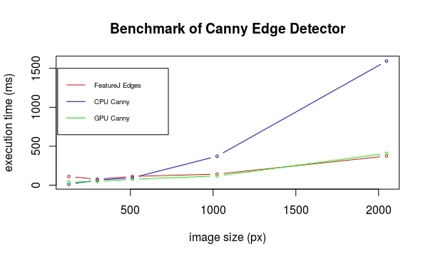

# Edge detection

Author : Cécilia Ostertag

## Introduction

Image processing is one of the most important fields in the domain of computer vision[^BOV2009]. Most scientific domains use information extracted from images in one way or another. For a computer to make sense of these images, and be able to extract meaningful data from them, it needs to be able to interprete and understand them.
That is where Image Processing comes in, allowing a computer to process an image and detect its major features, and to perform higher-level vision tasks like face recognition.
In our project, we will examine one specific field of image processing called edge detection.

The physical notion of edge comes from the shape of three dimensional objects or from their material properties. But, seeing as the acquisition process translates 3D scenes to 2D representations, this definition does not apply to image processing. In this report we will use the following definition by Bovik[^BOV2009]: "An edge can generally be defined as a boundary or contour that separates adjacent image regions having relatively distinct characteristics according to some features of interest. Most often this feature is gray level or luminance”. According to this definition, the pixels of an image belonging to an edge are the pixels located in regions of abrupt gray level changes. Moreover, to avoid counting noise pixels as edges, the pixels have to be part of a contour-like structure.
Edge detection is the process of finding the pixels belonging to the edges in an image, and producing a binary image showing the locations of the edge pixels.

In our project, we began by documenting the main linear edge detection approaches and algorithms, and their implementation in the image processing software ImageJ. We then performed a benchmark on the ImageJ plugins, in order to compare their execution time and the memory load for the Java Virtual Machine (JVM).

For the second part of our project, we made our own implementations of the Sobel, Prewitt, Robert's cros, Canny and Laplacian of Gaussian operators using ECMAscript6[^ECMA2011].

In this report, I will present the last part of our project : the implementation of Canny's algorithm[^CAN1986] using the GPU via the API WebGL 2. Finally, I will be able to compare qualitatively and quantitatively the CPU and GPU implementations, and to compare the GPU implementation with ImageJ plugin's implemenation.

**This report (written using the markdown format), and associated files, is stored in a repository on github:**
https://github.com/bockp/Edge-Detection-project

## Material & Methods

### Principle of Canny’s algorithm :

Canny’s algorithm uses the following steps:
- Noise reduction by convolving the image with a Gaussian filter of a given standard deviation
- Computation of the intensity gradient magnitude and orientation 
- Dividing orientation values (theta) into 4 directions : horizontal (0°), north-east /south-west(45°), vertical (90°), and north-west/south-east direction (135°)
- Non-maximum suppression by only keeping pixels which value is the maximum compared to the values of the two surrounding pixels according to the gradient orientation
- Finding strong edge pixels and weak edge pixels using a low and a high threshold values
- Tracing edges with hysteresis, by keeping weak edge pixels next to strong edge pixels and then extending the edges in several passes

### Fragment shaders :

All of the fragment shaders used for this implementation are adapted from Seth George Hall's thesis [^HAL2014] showing an implementation of Canny edge detection using OpenGL ES 2.0. It uses a pipeline of five fragment shaders, linked together via framebuffers ([Fig.1]) :

**Fig.1: Canny edge detection pipeline using OpenGL ES 2.0[^HAL2014]**

The *gpuEdgeCanny()* function is in *src/gpu/canny.js*, and the example files are *examples/testCanny*.js and *example/testCanny.html*. Like the CPU function, this function takes two parameters : the low and high threshold for the hysteresis.

The first two shaders, in *getFragmentSource_blurH()* and *getFragmentSource_blurV()*, correspond to a gaussian blur performed in two passes, horizontal and vertical, using a 5x5 kernel. The kernel is passed to the shader as a *uniform* float array, containing the following values : 0.0625, 0.25, 0.375, 0.25, 0.0625. The output is the resulting pixel value.

The third shader, in *getFragmentSource_sobel()*, is the computation of the gradient magnitude and orientation using Sobel's horizontal and vertical kernels. Here I modified the original code because the author ommited to flip the kernels before the convolution so it was giving poor results. The kernels are defined as *uniform* parameters. To compute the gradient direction, the author's method is to multiply the gradient with a rotation matrix and measure it's angle, and then classifying this angle into eight directions. The result of this step is stored into the output : **outColor.r** is the gradient magnitude and **outColor.gb** is the (X,Y) orientation of the gradient.

The fourth shader, in *getFragmentSource_nonmax()*, performs the non-maximum suppressions and the double threshold. For the non-maximum suppression, the gradient magnitude of the neighboring pixel in the gradient direction are computed and then compared to the gradient magnitude of the current pixel, using the *step* function. If it is not the maximum, the gradient magnitude value is multiplied by 0. The *smoothstep* function is then used to compare the gradient magnitude to the low and high threshold. This way if the gradient magnitude of the current pixel is either not a maximum or inferior to the low threshold the pixel stength is set to 0. If it is superior to the high threshold, meaning that it is a strong pixel, its stength is set to 1, and if it is a weak pixel its strength will be between 0 and 1. In the output, **outColor.r** is the strength value, and the three other components are equal to zero.

Finally, the last shader, in *getFragmentSource_hysteresis()*, performs the edge tracing with the hysteresis. The edge strength of the eight neighboring pixels is retrieved, and the pixel is accepted as an edge pixel if the sum of the eight neighbors' strenght is superior to 2. The last line is modified so that the output value is equal to 1 if the pixel is an edge, and to 0 if the pixel is not an edge.

### Benchmarking process

The benchmark was done using a computer with an Intel core I7 @4.0 Ghz, on Linux Ubuntu 16.04 64 bits with a kernel 4.10. The GPU is a nvidia gtx1070. The version of ImageJ is the 1.51q, using Java 1.8.0\_112 (64 bits). I fixed the choice of processor with the taskset command to avoid a sharing of the processor load, and fixed the processes with a high priority to avoid preemption.

For this benchmark, I used the same picture ("coins", in uint8), in five different sizes : 128x105 px, 300x246 px, 512x420 px, 1024x840px, and 2048x1679 px, to show how the performance of the functions vary when increasing the complexity of the input image. I tried to use a 4096x3360 image but that raised an "out of memory" error with the CPU function and a crash of the navigator with the GPU function. 

## Results

### Edge detection on a test image :

The following figure represents the result of the *gpuEdgeCanny()* function with parameters low threshold = 50.0, high threshold = 100.0, compared with the result of the CPU *canny()* function with parameters low threshold = 15.0, high threshold = 30.0, and sigma = 2.0 , and the plugin Canny Edge Detector[^GIB2011] with parameters low threshold = 2.5, high threshold = 5.0, and sigma = 2.0 ([Fig.2]). We can see that the edges of the face, hat and shoulder are well detected, as well as some details on the hat feathers. The GPU function is more effective at detecting the small details like the eyes, lipes and feathers. Also, contrarly to the CPU function there are no false edges created by the borders of the image. 

**Fig.2: Result of Canny edge detection. 1:original image, 2:output of GPU function, 3:output of CPU function, 4:output of ImageJ Canny Edge Detector plugin (uint8 image)**

The function works well with float32 images, but there is a problem for uint16 images : the values of the gradient are too high, which results in very thick edges in the output ([Fig.3]). The problem seems to be when the result of the first fragment shader is passed to the second via the framebuffer.

**Fig.3: Result of gpuEdgeCanny() function with low threshold = 50.0, low threshold = 100.0. 1:original image, 2:output with uint8 image, 3:output with uint16 image, 4:output with float32 image**

### Benchmark results

I compared my function with the plugins Canny Edge Detector by Tom Gibara [^GIB2011] (thresholds = 2.5 and 5.0, sigma=2), FeatureJ Edges by Erik Meijering [^MEI2007] (thresholds = 2.5 and 5.0, sigma=2), and my previous JavaScript implementation, using uint8 images ([Fig.4]). This function outperforms the Canny Edge Detector function, which we showed in our previous report was unexpectedly time consuming, so I did not display it on the graph. Contrarly to the CPU implementation, where the execution time was drastically increasing with the dimension of the input image, the GPU implementation has an exetuction time similar to FeatureJ plugin. This result confirms that using the GPU for graphic computation is faster than using the CPU. Also the GPU implementation does not use any loops or IF statements, which also reduces the execution time.

{width=50% height=50%}

**Fig.4: Execution time of FeatureJ Edges plugin, CPU implementation, and GPU implemenation, with five increasing image sizes (uint8 images)**

With uint16 and float32 images ([Fig.5]), we can see that the execution times are almost the same. It seems to be a bit higher with uint16 images, but it is difficult to interpret this result given that the processing of uint16 images is not completely functionnal.

{width=50% height=50%}

**Fig.4: Execution time of gpuEdgeCanny() function, with five increasing image sizes, for uint8, uint16, and float32 images**

## Discussion and Conclusion

Canny Edge Detector implemented with WebGL 2 can handle the processing of pictures up to 2048x1679 pixels before a crash of the navigator. My implementation handles uint8 and float32 images. Visually, it is more sensible to details than the CPU and ImageJ functions, even with high threshold values, which results in the detection of high quality contours.

The execution time is smaller than the one for the CPU implementation, and roughly the same as ImageJ's functions, meaning that it is a successfull adaptation from ImageJ's java implementation to WebGL. It allows a user to process images as efficiently but directly using the navigator.

However, these functions were benchmarked using a powerfull CPU and GPU, so the performance will be lower using for example a laptop or a smartphone.

[^GIB2011]: Gibara T. Canny Edge Detector plugin for ImageJ image processor.

[^MEI2007]: Meijering E. FeatureJ: A Java Package for Image Feature Extraction.

[^ECMA2011]: ECMAScript EC. European Computer Manufacturers Association and others. ECMAScript language specification. 2011.

[^BOV2009]: Bovik AC, editor. The essential guide to image processing. Academic Press; 2009 Jul 8.

[^CAN1986]: Canny J. A computational approach to edge detection. IEEE Transactions on pattern analysis and machine intelligence. 1986 Nov(6):679-98.

[^HAL2014]: Hall SG. GPU Accelerated Feature Algorithms for Mobile Devices. March 2014.

