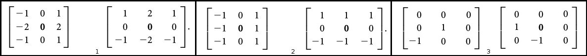
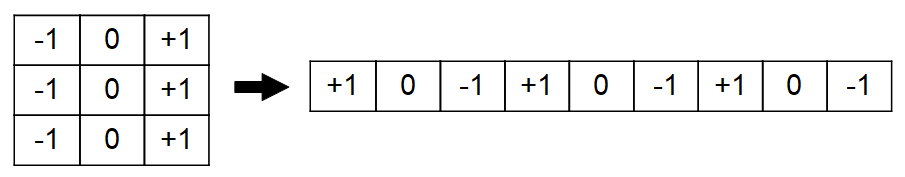

# Edge detection

Authors : Ophélie Thierry

[comment]: <>
[comment]: <for exemple, this is a comment>

## Introduction

### Several general notions about the edge detection

Image processing is one of the most important fields in the domain of computer vision[^BOV2009]. Most scientific domains use information extracted from images in one way or another. For a computer to make sense of these images, and be able to extract meaningful data from them, it needs to be able to interprete and understand them.
That is where Image Processing comes in, allowing a computer to process an image and detect its major features and reducing mistakes, variance linked to the experimenter leading to less biased conclusions, perform higher-level vision tasks like face recognition [^DOH2012] [^SCH2015]. In our project, we will examine one specific field of image processing called edge detection.

The physical notion of edge comes from the shape of three dimensional objects or from their material properties. But, seeing as the acquisition process translates 3D scenes to 2D representations, this definition does not apply to image processing. In this report we will use the following definition by Bovik (2009): "An edge can generally be defined as a boundary or contour that separates adjacent image regions having relatively distinct characteristics according to some features of interest. Most often this feature is gray level or luminance”[^BOV2009]. According to this definition, the pixels of an image belonging to an edge are the pixels located in regions of abrupt gray level changes. Moreover, to avoid counting noise pixels as edges, the pixels have to be part of a contour-like structure.
Edge detection is the process of finding the pixels belonging to the edges in an image, and producing a binary image showing the locations of the edge pixels.

Among all the implemented image analysis software, ImageJ is one of the most used as one of the most ancient, free, open-source, easy to use and with an extansive architecture implemented in Java. It's a generalist software but the differents plugins coded by the community allow it to take care of a wide range of images and be enough configurable to become very efficient and specific [^SCH2012] [^ELI2015] [^RUE2017] [^KAI2015].

### Interest of changing the implementation language.

Currently, ImageJ is mainly present as a desktop software downloadable. However, there is an applet which can be used by Java-enabled browser [^SCH2012]. Among the different implementation langage, Java and Javascript share only several expressions in their langage, but Java is a compiled langage and less stringent on its typing and doesn't have a portability as good as the JavaScript which is an interpreted langage and a major component in the development of curent application running within a web browser [^BIE2013]. Implement the ImageJ functions in JavaScript could improve the efficiency of this applications and reduce their calculation time [^WOL2013]. In the Edge Detection case, it was demonstrated in the second repport.

A supplemental way to improve the efficiency of this applications is to use WebGL, an API allowing to execute scripts in JavaScript on the Graphic Processing Unit (GPU), allowing the parallelization of the operations executed, reducing the calculation time and improve rendering performance and quality [^SHA2013] [^ROS2015]. Also WebGL is well supported by the main web browser [^SHI2017]. Various ameliorations were add in the WebGL2 version as the multiline template literals, the standardisation of the Vertex Array Objects or possibility to create Uniform Buffer Objects.

### Aim of the project

In our project, we began by documenting the main linear edge detection approaches and algorithms, and their implementation in the image processing software ImageJ [^SCH2015]: convolution with edge templates (Prewitt [^PRE1970], Sobel [^SOB1968], Kirsch [^KIR1971], Robert's Cross [^ROB1963]), zero-crossings of Laplacian of Gaussian convolution[^MAR1980], zero-crossings of directional derivatives of smoothed images (Canny[^CAN1986]). 

We then performed a benchmark on the ImageJ plugins, in order to compare their execution time and the memory load for the Java Virtual Machine (JVM). For the second and third part of our project, we made respectively our own implementations of the Sobel, Prewitt, Robert's cros, Canny and Laplacian of Gaussian operators using ECMAscript6[^ECMA2011] and WebGL2 [^HAL2014].

This repport will be focused on the three convolutions with edge templates : Prewitt, Sobel and Robert's Cross. Informations about the other edge detection algorithms can be seen in the previous repports. 

The link to our github repository containing our reports in markdown format, the images, and the code for the benchmark and algorithms is : https://github.com/bockp/Edge-Detection-project.

## Material & Methods

### Implementation of the functions

**Fig.1: Horizontal and vertical kernels 2D kernels : 1:Sobel operator, 2:Prewitt operator, 3:Robert's cross operator**

**Fig.2: Implementation of the Prewitt horizontal kernel in a list.**

The corresponding script is in the */src/gpu/edge.js* file, and the related exemples in the *exemples/* repository in the files *testEdge.html* and *testEdge.js*.

As the three convolution share the same process, a general function has been implementated, taking into argument the raster, the graphical environment and a specific kernel. This function will be called by three functions, each one specialized in a specific convolution. All the specific vertical and horizontal kernels for each convolution are implemented as lists in constant global variable outside the main functions. In order to facilitate the implementation, the six lists have the same size, and zero are add to the Robert cross kernels. The result is an image in which the edges have high pixel values compared to the rest of the image.

In order to facilitate the localization of the result in the webpage, the gpuEnv where the picture has to be displayed is takken as argument for each function.

#### *gpuEdgeSobel()*,  *gpuEdgePrewitt ()*, *gpuEdgeRobert ()*

These three functions are build in the same way. Each of them take into account the image and the graphical environment, and call the *gpuEdge()* function with the lists corresponding to the specific kernel.

#### *gpuEdge()*

It's the general function which will be called by the three others. It take four arguments : the picture, the graphical environment where the picture has to be displayed and the vertical and horizontal kernel (*kernelV* and *kernelH*) used for treating the picture. This function use only one shader.

The vertex shader is defined as the constant *src_vs* which transform the image coordinates in order to make them compatible with the displaying in the canvas. The fragment shader, defined as the constant *src_fs*, for each coordinate get the values of the corresponding neighboring elements and use it to realise the convolution according to the values of the kernel used as argument. The final value is stored in the vec4 *outputColor* for each coordinate.

### Benchmark

## Results
[comment]: <Results: A comparison between ImageJ, CPU and GPU depending of image size and kernel size.>

## Discussion
[comment]: <Discussion: what about the benchmarks.>

## Conclusion
[comment]: <Conclusion: conclusion, improvements, perspectives>

## References

[^ABD2015]: Abdelsamea MM, Gnecco G, Gaber MM, Elyan E. On the relationship between variational level set-based and som-based active contours. Computational intelligence and neuroscience. 2015 Jan 1;2015:34.

[^BIE2013]: Bienfait B, Ertl P. JSME: a free molecule editor in JavaScript. Journal of Cheminformatics. 2013;5:24. doi:10.1186/1758-2946-5-24.

[^BOV2009]: Bovik AC, editor. The essential guide to image processing. Academic Press; 2009 Jul 8.

[^CAN1986]: Canny J. A computational approach to edge detection. IEEE Transactions on pattern analysis and machine intelligence. 1986 Nov(6):679-98.

[^CHAA2014]: Chaabane SB, Fnaiech F. Color edges extraction using statistical features and automatic threshold technique: application to the breast cancer cells. Biomedical engineering online. 2014 Jan 23;13(1):4.

[^CHO2016]: Choudhry P. High-Throughput Method for Automated Colony and Cell Counting by Digital Image Analysis Based on Edge Detection. PLoS One. 2016; 11(2): e0148469.

[^DAV1975]: Davis LS. A survey of edge detection techniques. Computer graphics and image processing. 1975 Sep 1;4(3):248-70.

[^DER1987]: Deriche R. Using Canny's criteria to derive a recursively implemented optimal edge detector. International journal of computer vision. 1987 Jun 1;1(2):167-87.

[^DIN2001]: Ding L, Goshtasby A. On the Canny edge detector. Pattern Recognition. 2001 Mar 31;34(3):721-5.

[^DOH2012]: Doherty G, Mettrick K, Grainge I, Lewis PJ. Harwood C, Wipat A (Ed). Chapter 4 - Imaging fluorescent protein fusions in live bacteria. In Methods in Microbiology, Systems Biology of Bacteria. Academic Press. 2012; 39(4):107-126

[^ECMA2011]: ECMAScript EC. European Computer Manufacturers Association and others. ECMAScript language specification. 2011.

[^ELI2015]: Eliceiri KW, Berthold MR, Goldberg IG, et al. Biological Imaging Software Tools. Nature methods. 2012;9(7):697-710. doi:10.1038/nmeth.2084.

[^GRE2016]: Grega M, Matiolanski A, Leszczuk M. Automated Detection of Firearms and Knives in a CCTV Image. Sensors 2016, 16, 47; doi:10.3390/s16010047.

[^HAQ2015]: Haq I, Anwar S, Shah K, Khan MT, Shah SA. Fuzzy Logic Based Edge Detection in Smooth and Noisy Clinical Images. PLoS One. 10(9):e0138712, 2015.

[^JAC2018]: Jackson D, Gilbert J. WebGL 2.0 Specification. 2018. https://www.khronos.org/registry/webgl/specs/latest/2.0/

[^JAL2017]: Jalalian A, Mashohor S, Mahmud R, Karasfi B, Saripan MIB, Ramli ARB. Foundation and Methodologies in computer-aided diagnosis systems for breast cancer detection. EXCLI Journal, 16:113-137, 2017.

[^KEK2010]: Kekre HB, Gharge SM. Image segmentation using extended edge operator for mammographic images. International journal on computer science and Engineering. 2010;2(4):1086-91.

[^KAI2015]: Kainz P, Mayrhofer-Reinhartshuber M, Ahammer H. IQM: An Extensible and Portable Open Source Application for Image and Signal Analysis in Java. Martens L, ed. PLoS ONE. 2015;10(1):e0116329. doi:10.1371/journal.pone.0116329.

[^KIR1971]: Kirsch RA. Computer determination of the constituent structure of biological images. Computers and biomedical research. 1971 Jun 1;4(3):315-28.

[^LUO2017]: Luo S, Yang J, Gao Q, Zhou S, Zhan CA. The Edge Detectors Suitable for Retinal OCT Image Segmentation. Journal of Healthcare Engineering 2017; 2017: 3978410.

[^MAI2009]: Maini R, Aggarwal H. Study and comparison of various image edge detection techniques. International journal of image processing (IJIP). 2009 Jan;3(1):1-1.

[^MAR1980]: Marr D, Hildreth E. Theory of edge detection. Proceedings of the Royal Society of London B: Biological Sciences. 1980 Feb 29;207(1167):187-217.

[^PRE1970]: Prewitt JM. Object enhancement and extraction. Picture processing and Psychopictorics. 1970 Jan 1;10(1):15-9.

[^RIC1945]: Rice SO. Mathematical analysis of random noise. The Bell System Technical Journal. 1945 Jan;24(1):46-156.

[^ROS2015]: Rose AS, Hildebrand PW. NGL Viewer: a web application for molecular visualization. Nucleic Acids Research. 2015;43(Web Server issue):W576-W579. doi:10.1093/nar/gkv402.

[^RUE2017]: Rueden CT, Schindelin J, Hiner MC, DeZonia BE, Walter AE, Arena ET, Eliceiri KW. ImageJ2: ImageJ for the next generation of scientific image data. BMC Bioinformatics. 2017; 18:529.

[^SCH1997]: Scharcanski J and Venetsanopoulos A.N. Edge detection of color images using directional operators. IEEE Trans. Circuits Syst. Video Technol., 7(2):397–401, 1997.

[^SCH2012]: Schneider CA, Rasband WS, Eliceiri KW. NIH Image to ImageJ: 25 years of Image Analysis. Nature methods. 2012;9(7):671-675.

[^SCH2015]: Schindelin J, Rueden CT, Hiner MC, Eliceiri KW. The ImageJ ecosystem: An open platform for biomedical image analysis. Molecular reproduction and development. 2015 Jul 1;82(7-8):518-29.

[^SHA2013]: Shamonin DP, Bron EE, Lelieveldt BPF, et al. Fast parallel image registration on CPU and GPU for diagnostic classification of Alzheimer’s disease. Frontiers in Neuroinformatics. 2013;7:50. doi:10.3389/fninf.2013.00050.

[^SHI2017]: Shi M, Gao J, Zhang MQ. Web3DMol: interactive protein structure visualization based on WebGL. Nucleic Acids Research. 2017;45(Web Server issue):W523-W527. doi:10.1093/nar/gkx383.

[^SOB1968]: Sobel I. An isotropic 3× 3 image gradient operator, presentation at Stanford Artificial Intelligence Project (SAIL).

[^TRA1993]: Trahanias P.E and Venetsanopoulos A.N. Color edge detection using vector order statistics. IEEE Trans. Image Process., 2(2):259–264, 1993.

[^TRE2013]: Treloas KK, Simpson MJ, Kabla AJ. Sensitivity of Edge Detection Methods for Quantifying Cell Migration Assays. PLoS One, 8(6):e67389, 2013.

[^VIN2009]: Vincent OR, Folorunso O. A descriptive algorithm for sobel image edge detection. InProceedings of Informing Science & IT Education Conference (InSITE) 2009 Jun 12 (Vol. 40, pp. 97-107).

[^WOL2013]: Wollny G, Kellman P, Ledesma-Carbayo MJ, Skinner MM, Hublin JJ, Hierl T. MIA - A free and open source software for gray scale medical image analysis. Source Code Biol Med. 2013; 8:20. doi:10.1186/1751-0473-8-20.

[^ZHA2012]: Zhao J, Zheng W, Zhang L, Tian H. Segmentation of ultrasound images of thyroid nodule for assisting fine needle aspiration cytology. Health information science and systems. 2013 Dec 1;1(1):5.

[^ZHU2014]: Zhu F, Liu Q, Fu Y, Shen B. Segmentation of Neuronal Structures Using SARSA (lambda)-Based Boundary Amendment with Reinforced Gradient-Descent Curve Shape Fitting. PLoS One, 9(3):1–19, 2014.
