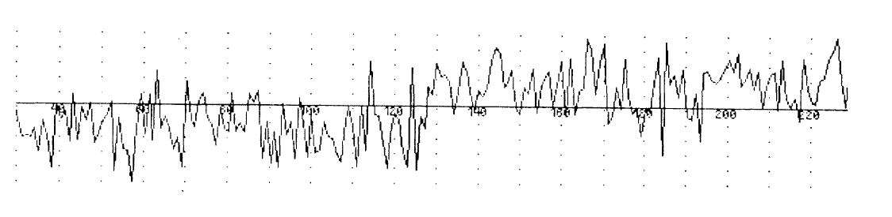
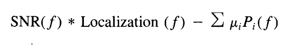
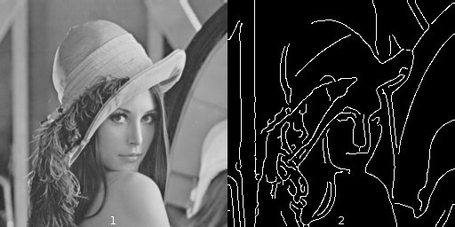

# Edge detection

# Authors : Cécilia Ostertag, Ophélie Thierry, Peter Bock*

# Introduction

Image processing is one of the most important fields in the domain of computer vision [^BOV2009]. Indeed, nearly every branch of science has a subdiscipline dedicated to retrieving information from the world, almost always through the use of recording devices storing that information in the form of discrete images or videos. For a computer to make sense of these images, it needs to be able to interprete them, understand them.
That is where Image Processing comes in, allowing a computer to process an image and detect its major features, and to perform higher-level vision tasks like face recognition.
In our project, we will examine one specific field of image processing, called edge detection.

The physical notion of edge comes from the shape of three dimensional objects or by their material properties. Obviously, as the aquisition process transaltes 3D scenes to 2D representations, this definition does not apply to image processing. In this report we will use the following definition : "An edge can generally be defined as a boundary or contour that separates adjacent image regions having relatively distinct characteristics according to some features of interest. Most often this feature is gray level or luminance” [^BOV2009]. According to this definition, the pixels of an image belonging to an edge are the pixels located in regions of abrupt gray level changes. Moreover, to avoid counting noise pixels as edges, the pixels have to be part of a contour-like structure.
Edge detection is the process of finding the pixels belonging to the edges in an image, and producing a binary image showing the locations of the edge pixels. 

In our project, we shall begin by documenting the 3 main linear edge detection approaches and algorithms, and their implementation in the image processing software ImageJ[^SCH2015]:
- Convolution with edge templates (Prewit, Sobel, Kirsh)[^SOB1968]
- Zero-crossings of Laplacian of Gaussian convolution [^MAR1980]
- Zero-crossings of directional derivatives of smoothed images (Canny)[^CAN1986]

We will then perform a benchmark on the imageJ plugins, in order to compare them by measuring their execution time and the memory load for the JVM.

# Material & Methods

## Edge-detection theory

The derivative or the gradient of the grey level intensity can be used to detect edges, as abrupt intensity changes translates to local extrema in the 1st derivative (Sobel approach), and to a zero-crossing in the 2nd derivative (Laplacian approach) [Fig.1].

**Fig.1: Edge detection in a 1D continuous space : fc(x) is the gray level intensity function, fc'(x) is the 1st derivative, and fc''(x) is the 2nd derivative. The dotted lines represent the edge locations**[^BOV2009]

Edge detectors based on the derivative are sensitive to noise, which lead to the development of several algorithms. Most of them use a filter to reduce noise before actually detecting edges in the image [^BOV2009].
These algorithms usually have three main steps:
- smoothing: use of a filter to suppress the noise.
- differentiation: amplification of the edges in the image
- decision: detection of edges using 1st or 2nd derivatives usually combined with thresholding.

Errors in edge detection can either be false positives (classification of non edge pixels as edge pixels) or false negatives (classification of edge pixels as non-edge pixels). There is also a conflict between the correct detection of edges and the precise localization of their position. 

## Sobel 

The Sobel Operator, introduced in a presentation at the Standford A.I Project in 1968 by Irwin Sobel[^SOB1968], is the default algorithm implemented in ImageJ for the Find Edges function, and is considered one of the simplest functional Edge Detection algorithms out there.

It is based on the 1st derivative, or gradient, of the gray level intensity function [Equation.1]. 

**Equation.1: Gradient of a continuous gray level intensity function fc(x,y), where ix and iy are the unit vectors in the x and y directions [^BOV2009]**

After finding all the local extrema of the gradient magnitude, a thresholding is applied and the points where the magnitude is superior to a given threshold are classified as candidate edge points [Equation.2].

**Equation.2: Thresholding of the gradient magnitude, where T is the threshold[^BOV2009] **

Finally, to obtain edges as zero-width segments, a thinning step is required : if the gradient magnitude is not a local maximum along the gradient direction, the point is suppressed from the edge candidates.

In practice, this algorithm works by using two masks, one horizontal and one vertical[^VIN2009] [Fig.2], these masks are designed to respond maximally to edges in the horizontal and vertical directions, respectively, and also smoothen out the gaussian noise in advance to reduce the noise sensitivity of the algorithm.

**Fig.2: Sobel horizontal and vertical masks**

The two resulting images are then combined to get an image representing the approximate  absolute  gradient  magnitude of the original image [Fig.3].

**Fig.3: (a)original image,(b) sobel Y-gradient image, (c) sobel X-gradient image, (d)absolute gradient magnitude image**

## Laplacian based methods:

The Laplacian is a 2D isotropic measure of the 2nd spatial derivative [Equation.3]. It is used to detect regions of rapid intensity change in an image :
- In the regions of constant intensity (intensity gradient equal to zero), the Laplacian is equal to zero. 
- In regions where there is a change in intensity, the Laplacian is positive on the darker side, and negative on the lighter side.

**Equation.3: Laplacian of a continuous gray level intensity function fc(x,y) [^BOV2009]** 

This has the effect of highlighting the edges in the image, and can be used as an enhancement technique, by adding the filtered image to the original image. 

The Laplacian can be estimated by designing a pair of 1D 2nd derivative filters and combining them into a 2D filter [Equation.4]

**Equation.4: Discrete Laplacian estimate for an image f(n1,n2) [^BOV2009]**

Other 3x3 kernels are :

The Laplacian opeator is usually used on gray level images, previously smoothed with a Gaussian filter to reduce noise. It is also possible to convolve the Gaussian smoothing filter with the Laplacian filter, before convolving this Laplacian of Gaussian (LoG) [Equation.5] with the image. 

**Equation.5: Laplacian of Gaussian function gc(x,y), where sigma is the standard deviation of the Gaussian function [^BOV2009]**

To implement a discrete form, a filter can be constructed by sampling this equation after choosing a value for sigma. The Gaussian and Laplacian kernels are both small so it requires fewer operations than using both filters on the image. Another advantage of the LoG is that it can be calculated in advance as it is independent of the image being processed. It is important to note that the result of these edge detectors is highly influenced by the standard deviation used for the Gaussian filter chosen for the smoothing step. The LoG can also be approximated by the Difference of Gaussian (DoG).

It is not possible to directly extract the edge orientation information from the Laplacian output. To extract the edges, we need to detect the zero-crossings in the output of the Laplacian (or the LoG), i.e. the regions of the image where the Laplacian passes through zero. However this can also happen in regions that are features other than edges in the image and can be the cause of false positives.
The input of the zero-crossing detector is the LoG filtered image, and the output is a binary image with lines representing the positions of all the zero-crossing points. Each pixel of the image is compared to its eight immediate neighbors, and a pixel is classified as a zero-crossing if its sign is different than the sign of its neighbor. [Equation.6] 

**Equation.6: Zero-crossing classification of a pixel p [^BOV2009]**

All of the contour lines are closed lines because the strength of the edge is not considered, so even gradual intensity transitions result in a zero-crossing. As previously indicated, local minima of the gradient magnitude can cause false edges, that can be eliminated by using a threshold for edge strength, causing breaks in the closed contours.

In ImageJ, two plugins provide an implementation of the LoG operator.
The first one is the Laplacian plugin included in the FeatureJ package created by Erik Meijering. This plugin is based on ImageScience, a java library for image processing, which provides tools for computing the LoG of an image and detecting the zero-crossings. The only parameter accessible to the user is the laplacian smoothing scale, meaning the standard deviation used for the Gaussian kernel.
The second one is the LoG\_Filter plugin, by Lokesh Taxali and Jesse Jin. This plugin is composed of a unique class file and provides more parameters to the user : sigma (standard deviation for the Gaussian filter), filter width (size of the LoG kernel), threshold for 1D DoG filtering, and delta (level for adjusting zero-crossings). Unlike the previous plugin, this one involves thresholding of the LoG output with a Difference of Gaussians. Moreover, its use is limited to 8-bit images.

## Canny

The Canny approach uses a mathematical representation, through a convolution, in order to define edges in a gray-level image. By cross-section, the signal on an image will be converted to a gradient in a specific direction [Fig.4] and will define a one-dimensional model for which the local maxima will correspond to edges. 

**Fig.4: Grey-level signal after the cross section of a target picture [^CAN1986]**

The answer signal will be subdivided into two compounds : a noise function and an edge function. So the edge is detected by the convolution of the signal with a specific filter which had to maximize the result to a mathematical equation which is the representation of three parameters of optimization. Unlike the other methods, the aim of this approach is to be able to combine the detection of the edge, its closer localization on the image, and to not duplicate the edges founded (this last point is also called the unambiguity of the signal).
*(pas encore sure de ma transition avec la phrase suivante).* 
Three mathematical parameters will be thus defined and taken into account to assess the edge function : the signal-to-noise ratio (SNR), the localization and several constraints. The two first ones will be defined as parameters of equal importance which have to be maximized in parallel, and the third as a constraint. The function has to maximize the following equation [Equation.7]

**Equation.7: Equation used to define the best function to find edges from a grey-level signal [^CAN1986]**

Maximizing the product of SNR and localization will allow to their simultaneous maximisation *(?)*, and each parameter is defined on a given interval.  *(sais pas si foncièrement utile)*

The noise is defined as Gaussian random quantity and as the signal is continuous, the mathematical approaches have to use the integral instead of the correlation to describe the behavior of the signal in relation to the model. *(sais pas si foncièrement utile : utile pour comprendre le raisonnement (donc pour moi) mais sont sensés couler de source)*

The SNR assesses the quality of a signal according to a model, by using the model as numerator and the noise definition as the denominator. In this case, both parameters are defined as integral, respectively the absolute value of a convolution integral and the root-mean-square response to the noise function which will represent the area of dispersion from the model. 

As edges are defined as local maxima, the addition of the firsts derivatives of the edge function and noise function is equal to zero, so both of them are opposite and can be used to define the localization parameter. It will be defined as the first derivative of the SNR function *(suis pas encore pleinement sure qu'on puisse faire cette approximation, formules sont basiquement idem, mais doit voir si méthode de dérivation est bonne)*.

The last parameter represents the additional constraints, and will be defined as the sum of the series of penalty functions, each of them will be modulated by a specific value which will define the importance of the associated constraint in the model. One of them concerns the unambiguity of the signal, as several local maxima close to each other in the vicinity of the edge can lead to the definition of several false boundaries. Thus they define an expression for the distance between adjacent noise peaks in a defined space, using the Rice noises studies about the response of a function to a Gaussian noise [^RIC1945]. This solution involves the first and the second derivative of the answer function and leads to the definition of a factor which will define the number of maxima in a specific width which can lead to a false answer. This factor corresponds to a fraction of the define interval of the beginning. 

After several demonstrations, Canny originally defined the Gaussian operator as the most efficient to maximize this equation [Equation.8], and it has the advantage to be easier to implement for a two dimensional model. 

**Equation.8: Gaussian filter and its first derivate [^CAN1986]**

Even if Canny model is often used in edge detection for image processing, several limits can be seen, mainly the noise which will define false edges and discontinuous edges (mainly linked to textured regions on image [^CAN1986]), even if this model is considered as less sensitive to noise than Sobel's and Laplace's [^ZHA2012] [^ABD2015], and the important time consumption calculation [^CHAA2014]. 

The implementation of the Canny model is relatively simple. First the image has to be treated by a Gaussian filter, then determine the gradient magnitude, assess if the pixel is a local maxima by comparing its value to its two closer neighbor on the axis in order to find local maxima. This firsts steps lead to a first edge map consisting of binary values (0 and 255). A thresholding is then done on the map by defind a low and high threshold value which will define major and minor pixels used for a thresholding final step hysteresis, (en gros, c'est le fait qu'une valeur x passée dans une transformation puit une transformation reverse ne reviendra pas au niveau initial, sa variation n'est pas totalement réversible, induit noise et écarts au modèle, mais dans la plupart articles ne prennent pas la peine de le redéfinir) all the edge containing value above the higher threshold, will be kept on the map, but the pixels of this edge which are under the lower value will be removed. This last point can lead to disrupted edges [^CAN1986], [^DER1987], [^DIN2001], [^BOV2009], [^ABD2015].

Several modification where done to the model in order to improve its efficiency, as the Deriche modification, allowing the model to treat an infinite extent which lead to a change of the efficiency of the Canny method according to the values considered after a Fourier transformation, leading to the development of a new fonction with only one constant parameter α (Deriche 1987) *(du coup, vu que ça passe par ça, suis pas sure de pouvoir le maintenir, mais on trouve en plugin des filtres Canny-Deriche)* [Equation.9], or the Ding modification, able to take into account pixels under the low threshold value in order to correct the edge disruption [^DIN2001].

**Equation.9: Gaussian filter and its first derivate [^DER1987]**

Currently, several plugins using this method have been developed for ImageJ : the Edge Detection by Canny-Deriche filtering by Thomas Boudier,  the Edge Detector by Carmelo Pulvirenti, able to use other operators (LoG, DroG) and FeatureJ Edges by Erik Meijering. All of them require from the user a Gaussian kernel value or any other similar parameter which will be involved in the initial treatment step by the Gaussian filter, and will define the width of the neighborhood in which only a single peak will be identified, and the low and high threshold value. 
*(doit encore potasser code FeatureJ pour tt comprendre ses différences avec autres puisque je trouve pas article spécifique)* *décrire les paramètres demandés et leur utilité*

## Benchmarking process

The performance and the efficiency of each edge detection function can be assessed through several parameters: the execution time necessary for the processing of an input image and the memory load corresponding to this opperation.

To perform this benchmark[^MCN1992], we implemented a small JavaScript plugin : *benchmark.js*. This script measures, on one hand the time elapsed between the start and the end of a given ImageJ or plugin function, and on the other hand the memory used by ImageJ JVM at the end of this function. Java uses a garbage collector to handle memory allocation so our results have to be treated cautiously,even if we forced the garbage collector to run before the execution of the function. 

For both measurements we ran the operation 100 times, after a front loading step consisting of running each function five times without recording the results. This was done to avoid outliers in our data, because the first executions of a function are usually slower. The image used for this benchmark is Lena, 8-bit, 256x256 pixels. 

The benchmark was done on Linux, with the version 1.51q of ImageJ, using Java 1.8.0\_112 (64-bits).  *Ajouter la description de la machine utilisée : ref processeur, vitesse, conso, OS, et la charge processeur*

# Results

The results obtained with each edge detection function were obtained with the same image : Lena 256x256 pixels. All plugins except Canny Edge Detector can only be used on greyscale images, so we chose to use the 8-bit version of this image. 

## Find Edges function (Sobel algorithm)

The output of ImageJ Find Edges function is an 8-bit image in wich the contours are in white [Fig.5].

**Fig.5: Result of Find Edges function. 1:Input image, 2:Output image**

## Log\_Filter plugin (LoG algorithm)

With this function, we can compute the output of the LoG filtering (in a 0 to 255 range), the absolute value of filtering, the results representing the LoG values -1, 0 or 1, the zero-crossings overlaid to the input image,  and finally the output of the zero-crosing detector. The final output is a binary image where the edge pixels are in white [Fig.6]. All the contour lines have a single-pixel width, and due to the DoG filtering they are not closed.

**Fig.6: Result of Log\_Filter plugin, with sigma=3, filter width=2, DoG threshold=0 delta=0. 1:Input image, 2:LoG output, 3:Absolute value of filtering, 4:Results representing values -1,0 or 1, 5:Zero-crossings overlaid to input image, 6:Zero-crossings **

## FeatureJ Laplacian plugin (LoG algorithm)

This function only provides the display of the output of the LoG and the zero-crossing detector [Fig.7]. The contours are also of single-pixel width and in absence of a thresholding all contours are closed lines.

**Fig.7: Result of FeatureJ Laplacian plugin, with smoothing scale=3 1:Input image, 2:LoG output, 3:Zero-crossings **

## Canny Edge Detector plugin (Canny algorithm)

The output of this function is a binary image where the edge pixels are white [Fig.8].

**Fig.8: Result of Canny Edge Detector plugin, with gaussian kernel radius=2, low threshold=2.5, high threshold=7.5. 1:Input image, 2:Output image **

## FeatureJ plugin (Canny algorithm)

The output of this function is also binary image where the edge pixels are white [Fig.9].

**Fig.9: Result of FeatureJ Edges plugin, with smoothing scale=2, low threshold=2.5, high threshold=7.5. 1:Input image, 2:Output image **

*Autre plugin pour Canny ?????*

## Benchmark results

The results of the benchmark for the execution time [Fig.10 and Fig.12] show that the Find Edges function is the quickest to run on this machine, with a mean of 0.88 ms, followed by Log\_Filter, FeatureJ Laplacian and FeatureJ Edges which do not have a mean execution time superior to 50 ms. However the Canny Edge Detector plugin has an average exectution time of 205.8 ms.

**Fig.10: Result of the benchmark for the execution time of ImageJ edge detection functions**

For the JVM memory load [Fig.11 and Fig.12], we can see that Find Edges uses the least memory, with a mean of 27.4 MegaBytes. Then the three functions Canny Edge Detector, FeatureJ Edges and Log\_Filter have an average of about 50 MB. And finally the most memory expensive function is FeatureJ Laplacian with a mean of 55 MB.

**Fig.11: Result of the benchmark for the memory load of ImageJ edge detection functions**

**Fig.12: Average execution time and used memory for ImageJ edge detection functions**

Given that the Canny Edge Detector plugin can also be used on RGB images, we also ran a benchmark comparing the execution time and memory load difference for this plugin on RGB and 8-bit images[Fig.15].

**Fig.15: Result of the benchmark of Canny Edge Detector plugin on 8-bit and RGB images, for both execution time and memory load**
# Discussion

## Qualitative Comparison

As can be seen in the above examples [Fig.5-9], the quality of the resulting edge detection depends a lot on which algorithm is used, and with what parameters. The outputs of all functions show us that the strong contours, corresponding to the hat,the face and the hair are well identified, while the contours of the details, like the hat's feathers are not detected.
 
For the Sobel algorithm, the edges are outlined correctly, though it also outlines noise (shadows, changes in color) as edges.
 
The Laplacian based algorithms, on the other hand, give an output with a lower amount of misidentified noise if configured properly, although they do not identify all of the edges.
As can be seen in the difference of output between the Log\_filter plugin [Fig.6 Image 5-6], which detects most edges without noise in the result, but misses out on edges which were blurred in the original image and the FeatureJ implementation [Fig.7 Image 3], that creates an output image that identifies edges everywhere in the image, leading to an output image that is hard to compare with the original image.
This error on the part of the FeatureJ implementation is most likely due the absence of thresholding, leading to the identification of very small variations in pixel values as indicative of an edge, whereas they are probably due to noise. Indeed, choosing a higher standard deviation for the gaussian filtering reduces the number of false positives but also reduces the precision for true positive edges [Fig.13].
 

**Fig.13: Result of FeatureJ Laplacian plugin, with various smoothing scales. 1:Input image, 2:smoothing scale=1, 3:smoothing scale=3, 4:smoothing scale=5 **
 
We must note that comparing these two results is difficult because the parameters provided to the user for the computation are not the same, except for the gaussian standard deviation. The results optimization is also different : while the FeatureJ plugin stops at the detection of the zero-crossings, the Log\_Filter uses an additional DoG filtering as a threshold on the LoG output.
 
The two Canny implementations [Fig.8-9] give a better result than both the Sobel implementation, because they are less sensible to noise, and the LoG implementation, because they detect the real edges more accurately.
They are not perfect, and miss edges where the pixel values do not vary sharply on each side, and create edges in the presence of differences due to lighting.
All in all, the 2 Canny implementations give nearly identical results, though the FeatureJ implementation detects more continuous edges than the Canny Edge Detector.
Canny edge detector is the only plugin working on RGB images, and gives an output similar to the one obtained with the 8-bit image [Fig.14].

**Fig.14: Result of Canny Edge Detector plugin, with gaussian kernel radius=2, low threshold=2.5, high threshold=7.5. 1:8-bit input image, 2:8-bit output image, 3:RGB input image, 4:RGB output image **

## Performance Comparison

*recent innovations to improve the algorithms.*
*WHY is Canny Edge Detector so slowwwwwwwwwwwwwwwwwwwwwwwwwwwwwwwwwwwwwwwwwwww ???????????? --> aller voir dans l'implémentation*

*hard to compare the two laplacians outputs because different optimizations and initial parameters, same parameters for the two canny, also for the two canny FeatureJ version is faster*
 
 
 
 *comparer Canny edge detecor 8-bit et RGB*
 
 An RGB image being more complex because of its 3 channels, we would have expected higher processing time and memory load when running Canny Edge Detector plugin on the RGB version of our image. However, according to our results[Fig.15], this is not the case for either parameters.

 

# Conclusion

*de toutes les fonctions disponibles à travers imagej, Find Edges (Sobel) est la plus rapide et la plus légère en terme de mémoire, mais le plugin Canny Edge Detector bien que très lent est capable de traiter des images RGB donc utile pour un utilisateur dans ce cas de figure*
* parler des nouvelles optimisations pour les images couleur*

# References

[^ABD2015]: Abdelsamea MM, Gnecco G, Gaber MM, Elyan E. On the relationship between variational level set-based and som-based active contours. Computational intelligence and neuroscience. 2015 Jan 1;2015:34.

[^BOV2009]: Bovik AC, editor. The essential guide to image processing. Academic Press; 2009 Jul 8.

[^CAN1986]: Canny J. A computational approach to edge detection. IEEE Transactions on pattern analysis and machine intelligence. 1986 Nov(6):679-98.

[^CHAA2014]: Chaabane SB, Fnaiech F. Color edges extraction using statistical features and automatic threshold technique: application to the breast cancer cells. Biomedical engineering online. 2014 Jan 23;13(1):4.

[^DIN2001]: Ding L, Goshtasby A. On the Canny edge detector. Pattern Recognition. 2001 Mar 31;34(3):721-5.

[^DER1987]: Deriche R. Using Canny's criteria to derive a recursively implemented optimal edge detector. International journal of computer vision. 1987 Jun 1;1(2):167-87.

[^RIC1945]: Rice SO. Mathematical analysis of random noise. The Bell System Technical Journal. 1945 Jan;24(1):46-156.

[^ZHA2012]: Zhao J, Zheng W, Zhang L, Tian H. Segmentation of ultrasound images of thyroid nodule for assisting fine needle aspiration cytology. Health information science and systems. 2013 Dec 1;1(1):5.

[^SCH2015]: Schindelin J, Rueden CT, Hiner MC, Eliceiri KW. The ImageJ ecosystem: An open platform for biomedical image analysis. Molecular reproduction and development. 2015 Jul 1;82(7-8):518-29.

[^SOB1968]: Sobel I. An isotropic 3× 3 image gradient operator, presentation at Stanford Artificial Intelligence Project (SAIL).

[^VIN2009]: Vincent OR, Folorunso O. A descriptive algorithm for sobel image edge detection. InProceedings of Informing Science & IT Education Conference (InSITE) 2009 Jun 12 (Vol. 40, pp. 97-107).

[^MAR1980]: Marr D, Hildreth E. Theory of edge detection. Proceedings of the Royal Society of London B: Biological Sciences. 1980 Feb 29;207(1167):187-217.

[^MCN1992]: McNair CJ, Leibfried KH. Benchmarking: A tool for continuous improvement. John Wiley & sons; 1992.
